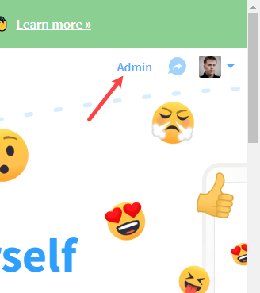
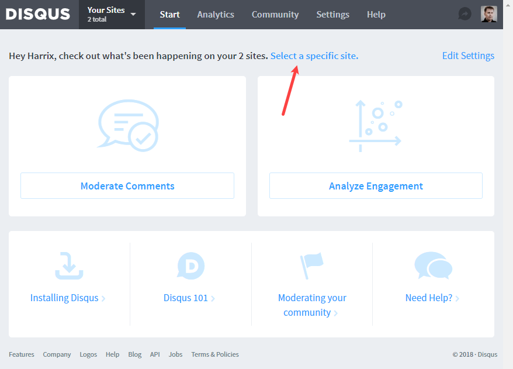
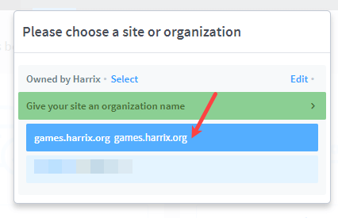
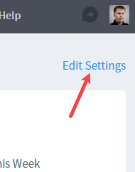
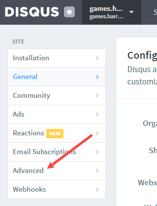
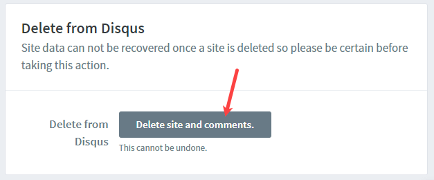
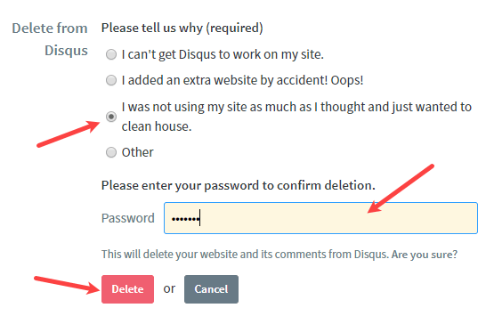

# Как удалить из disqus канал своего сайта

Система disqus замечательна как система комментариев, но иногда сайты устаревают, и хочется удалить сообщество (канал) на disqus.

Заходим на сайт <https://disqus.com/>.

Там справа наверху есть настройки. Там переходим в админку:

Выбираем конкретное сообщество, если у нас их несколько:

Переходим в настройки сообщества:

Далее переходим в расширенные настройки:

И в самом конце настроек будет функция удаления сообщества:

Ваш канал-сообщество удален.
