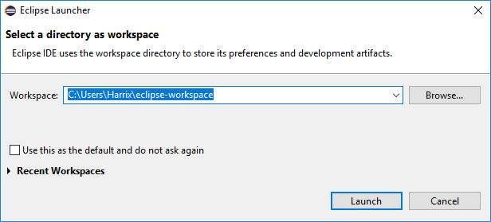
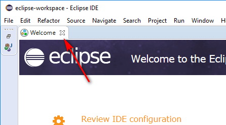
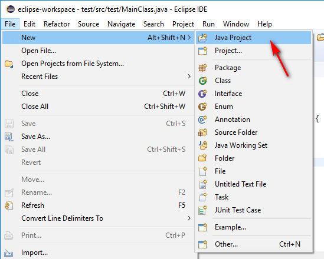
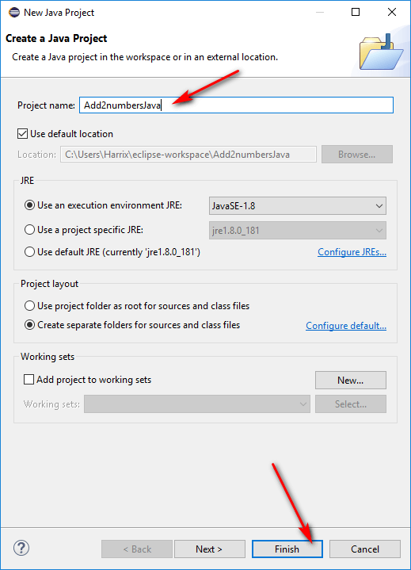
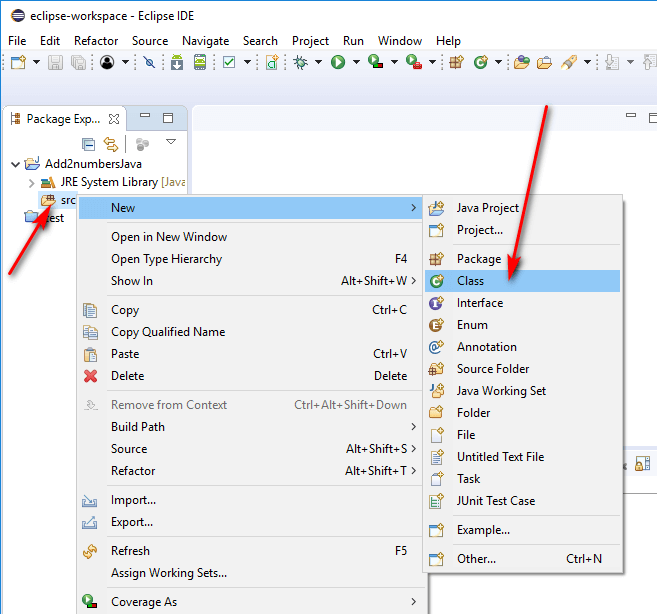
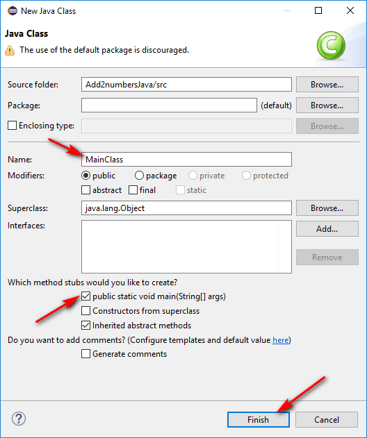
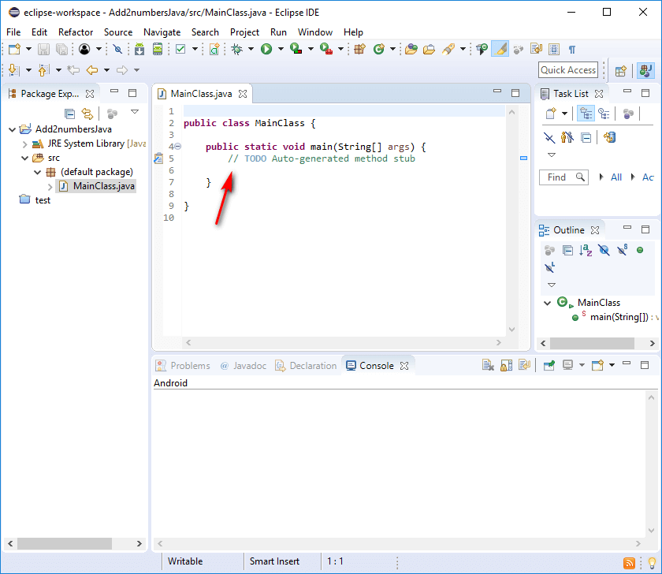
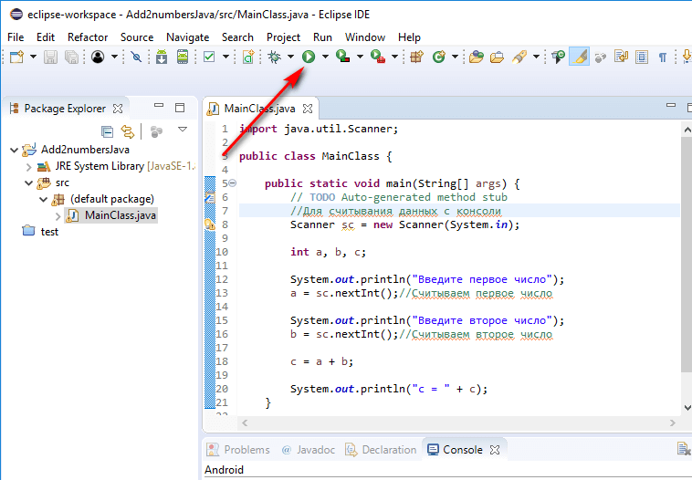
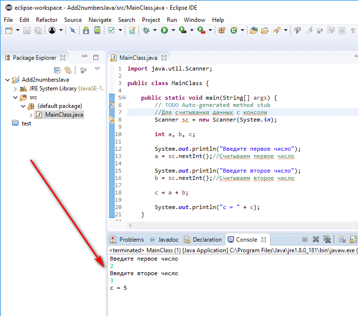

# Сложение двух чисел в Eclipse на Java (консольное приложение)


В статье рассказывается как создать консольного приложения сложения двух чисел под Java в Eclipse.

## Приготовления

В статье [Установка Eclipse в Windows](https://github.com/Harrix/harrix.dev-blog-2014/blob/main/install-eclipse-java/install-eclipse-java.md) <!-- https://harrix.dev/ru/blog/2014/install-eclipse-java/ --> узнаете, как всё установить и настроить.

## Создание проекта

Итак, открываем Eclipse. У меня приложение находится по адресу `C:\Android\eclipse\eclipse.exe`.

При старте спросят о папке, куда сохранять будем проекты:



_Рисунок 1 — Выбор места для сохранения проектов_

И закройте окно приветствия:



_Рисунок 2 — Закрытие окна приветствия_

Создадим новый проект:



_Рисунок 3 — Создание нового Java проекта_



_Рисунок 4 — Ввод названия проекта_

Правой кнопкой по папке `src` создаем новый класс:



_Рисунок 5 — Создаем новый класс_



_Рисунок 6 — Ввод имени класса и его параметров_



_Рисунок 7 — Созданный проект_

## Болванка приложения Java

Пропишем создание экземпляра класса `Scanner` для считывания данных с консоли a функции `main`:

```java
Scanner sc = new Scanner(System.in);
```

И нажимаем `Ctrl` + `Shift` + `O`, чтобы подключить нужные библиотеки.

В итоге получаем болванку программы на Java, которую потом удобно использовать для других приложений учебного толка:

```java
import java.util.Scanner;

public class MainClass {

  public static void main(String[] args) {
    // TODO Auto-generated method stub
    //Для считывания данных с консоли
    Scanner sc = new Scanner(System.in);

  }
}
```

## Написание кода основной программы

А теперь пропишем основной код нашей программы:

```java
int a, b, c;

System.out.println("Введите первое число");
a = sc.nextInt();//Считываем первое число

System.out.println("Введите второе число");
b = sc.nextInt();//Считываем второе число

c = a + b;

System.out.println("c = " + c);
```

Полная программа будет выглядеть так:

```java
import java.util.Scanner;

public class MainClass {

  public static void main(String[] args) {
    // TODO Auto-generated method stub
    //Для считывания данных с консоли
    Scanner sc = new Scanner(System.in);

    int a, b, c;

    System.out.println("Введите первое число");
    a = sc.nextInt();//Считываем первое число

    System.out.println("Введите второе число");
    b = sc.nextInt();//Считываем второе число

    c = a + b;

    System.out.println("c = " + c);
  }
}
```

Нажмите `Ctrl` + `S` для сохранения изменений.

## Запуск программы



_Рисунок 8 — Запуск приложения_

При вводе наших чисел получим вот это:



_Рисунок 9 — Вывод программы_

Вот наше приложение и написано.
