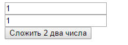
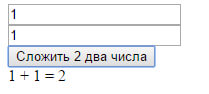

# Сложение двух чисел на HTML + JavaScript


В статье рассказывается как создать приложение сложения двух чисел на HTML + JavaScript.

<details>
<summary>📖 Содержание</summary>

## Содержание

- [Приготовления](#приготовления)
- [Создание болванки](#создание-болванки)
- [Наполнение HTML](#наполнение-html)
- [Функция JavaScript](#функция-javascript)

</details>

<https://codepen.io/Harrix/pen/ZqxpOv>

## Приготовления

Ничего не требуется кроме блокнота и браузера.

## Создание болванки

Создаем текстовой документ под именем `index.html`.

Закинем в него простую болванку HTML5 документа:

```html
<!DOCTYPE html>
<html lang="ru">
  <head>
    <meta charset="utf-8" />
    <meta
      name="viewport"
      content="width=device-width, initial-scale=1, shrink-to-fit=no"
    />
    <title>Программа сложения двух чисел</title>
  </head>
  <body></body>
</html>
```

Если мы сохраним документ и откроем в браузере, то увидим пустое белое окно, так как ничего видимого в документе пока нет — это просто болванка с шапкой, где располагаются некоторые мета-тэги (по сути их тоже можно было выкинуть), и пустое тело.

## Наполнение HTML

Так как нам нужно приложение, которое будет складывать два числа, то нужно два поля ввода текстовой информации. Следовательно, их нужно будет размещать в некоторой форме. Поэтому в теле HTML документа `<body></body>` разместим такую форму:

```html
<form>
  <input id="a" type="text" value="1" /><br />
  <input id="b" type="text" value="1" /><br />
</form>
```

Каждое поле имеет свой идентификатор `id` с названием переменной `a` и `b`. Также они имеют начальное наполнение.

Нам нужна кнопка для вычислений. Обычно на форме используется `input` тэг с `type=submit`, но он вызовет передачу параметров в форме с переходом на эту же или другую страницу. Поэтому используем обычную кнопку:

```html
<input type="button" value="Сложить 2 два числа" onclick="addition();" /><br />
```

При клике на кнопку будет вызываться функция JavaScript по имени `addition()`, которую позже пропишем.

Кроме этого, нам нужно место, куда JavaScript будет записывать результат вычислений. Для этого после формы пропишем пустой слой с определенным идентификатором `id="result"`:

```html
<div id="result"></div>
```

Общий документ будет иметь вид:

```html
<!DOCTYPE html>
<html lang="ru">
  <head>
    <meta charset="utf-8" />
    <meta
      name="viewport"
      content="width=device-width, initial-scale=1, shrink-to-fit=no"
    />
    <title>Программа сложения двух чисел</title>
  </head>
  <body>
    <form>
      <input id="a" type="text" value="1" /><br />
      <input id="b" type="text" value="1" /><br />
      <input
        type="button"
        value="Сложить 2 два числа"
        onclick="addition();"
      /><br />
    </form>
    <div id="result"></div>
  </body>
</html>
```

Если мы сохраним документ и его откроем, то получим следующее:



_Рисунок 1 — Запущенная HTML страница_

## Функция JavaScript

Теперь пропишем функцию `addition()`. Для этого пропишем к голове страницы пока пустую функцию внутри тэга `script`:

```html
<script>
  function addition() {}
</script>
```

Общий вид документа будет иметь вид:

```html
<!DOCTYPE html>
<html lang="ru">
  <head>
    <meta charset="utf-8" />
    <meta
      name="viewport"
      content="width=device-width, initial-scale=1, shrink-to-fit=no"
    />
    <title>Программа сложения двух чисел</title>

    <script>
      function addition() {}
    </script>
  </head>
  <body>
    <form>
      <input id="a" type="text" value="1" /><br />
      <input id="b" type="text" value="1" /><br />
      <input
        type="button"
        value="Сложить 2 два числа"
        onclick="addition();"
      /><br />
    </form>
    <div id="result"></div>
  </body>
</html>
```

Что нам нужно в этой функции? Вначале нам нужно найти соответствующие поля ввода текстовой информации и считать те значения, которые там записаны. Поиск элементов будем осуществлять с помощью функции `getElementById()`.

При этом сразу переведем значения из строкового типа в числовые целого типа:

```js
var a = parseInt(document.getElementById("a").value);
var b = parseInt(document.getElementById("b").value);
```

Теперь в переменных a и b хранятся значения в виде чисел. А, если там вообще ничего не будет в поле ввода? Тогда там будет храниться `NaN` значение. Нам это не нужно. Поставим проверку, что, если в поле ввода ничего нет, то пусть там будет как будто записан ноль:

```js
if (isNaN(a) == true) a = 0;
if (isNaN(b) == true) b = 0;
```

Теперь мы можем провести наши вычисления:

```js
var c = a + b;
```

Осталось только записать полученный результат. Для этого найдем наш пустой слой с `id="result"` и заменим его содержимое на то, что нам нужно, через свойство `innerHTML`:

```js
document.getElementById("result").innerHTML = a + " + " + b + " = " + c;
```

Итого, наш файл будет иметь вид:

```html
<!DOCTYPE html>
<html lang="ru">
  <head>
    <meta charset="utf-8" />
    <meta
      name="viewport"
      content="width=device-width, initial-scale=1, shrink-to-fit=no"
    />
    <title>Программа сложения двух чисел</title>

    <script>
      function addition() {
        var a = parseInt(document.getElementById("a").value);
        var b = parseInt(document.getElementById("b").value);

        if (isNaN(a) == true) a = 0;
        if (isNaN(b) == true) b = 0;

        var c = a + b;

        document.getElementById("result").innerHTML = a + " + " + b + " = " + c;
      }
    </script>
  </head>
  <body>
    <form>
      <input id="a" type="text" value="1" /><br />
      <input id="b" type="text" value="1" /><br />
      <input
        type="button"
        value="Сложить 2 два числа"
        onclick="addition();"
      /><br />
    </form>
    <div id="result"></div>
  </body>
</html>
```

Если сохраним файл, запустим его, и нажмем на кнопку, то получим следующее:



_Рисунок 2 — Результат выполнения программы_
