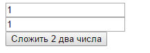

# Сложение двух чисел на HTML + PHP


В статье рассказывается как создать приложение сложения двух чисел на HTML + PHP.

## Содержание

- [Приготовления](#приготовления)
- [Создание болванки](#создание-болванки)
- [Наполнение HTML](#наполнение-html)
- [PHP код](#php-код)

## Приготовления

Нам потребуется так или иначе сервер, на котором просчитываются PHP скрипты. Можно установить локальный сервер (например, [тут](https://github.com/Harrix/harrix.dev-articles-2018/blob/main/apache-php-mysql/apache-php-mysql.md) | [🡥](https://harrix.dev/ru/articles/2018/apache-php-mysql/) описано, как я делаю у себя, но это лишь одна из миллиона инструкций в интернете) через установку связки Apache + PHP + MySQL + phpMyAdmin, можно воспользоваться уже готовыми сборками (Denver, Open Server, WampServer и другие). Можно использовать сервер на каком-нибудь виртуальном хостинге и так далее. В общем, вариантов много.

Далее предполагается, что у вас есть такой сервер, вы умеете запускать в браузере PHP скрипты.

## Создание болванки

Создаем текстовой документ под именем `index.php`.

Закинем в него простую болванку HTML5 документа:

```html
<!doctype html>
<html lang="ru">
  <head>
    <meta charset="utf-8" />
    <meta
      name="viewport"
      content="width=device-width, initial-scale=1, shrink-to-fit=no"
    />
    <title>Программа сложения двух чисел</title>
  </head>
  <body></body>
</html>
```

Если мы сохраним документ и откроем в браузере, то увидим пустое белое окно, так как ничего видимого в документе пока нет — это просто болванка с шапкой, где располагаются некоторые мета-тэги (по сути, их тоже можно было выкинуть), и пустое тело.

Если же вы открыли в браузере и увидели тот, текст, который написан выше, то, значит, вы неправильно открываете в браузере PHP скрипт.

## Наполнение HTML

Так как нам нужно приложение, которое будет складывать два числа, то нужно два поля ввода текстовой информации. Следовательно, их нужно будет размещать в некоторой форме. Поэтому в теле HTML документа `<body></body>` разместим такую форму:

```html
<form action="index.php">
  <input name="a" type="text" value="1" /><br />
  <input name="b" type="text" value="1" /><br />
</form>
```

Каждое поле имеет своё имя `name` с названием переменной `a` и `b`. Также они имеют начальное наполнение.

Нам нужна кнопка для вычислений:

```html
<input type="submit" value="Сложить два числа" /><br />
```

При клике на кнопку будет вызываться тот скрипт, который у нас прописан в форме в свойстве `action`.

Общий документ будет иметь вид:

```html
<!doctype html>
<html lang="ru">
  <head>
    <meta charset="utf-8" />
    <meta
      name="viewport"
      content="width=device-width, initial-scale=1, shrink-to-fit=no"
    />
    <title>Программа сложения двух чисел</title>
  </head>
  <body>
    <form action="index.php">
      <input name="a" type="text" value="1" /><br />
      <input name="b" type="text" value="1" /><br />
      <input type="submit" value="Сложить два числа" /><br />
    </form>
  </body>
</html>
```

Если мы сохраним документ и его откроем, то получим следующее:



_Рисунок 1 — Внешний вид HTML страницы_

## PHP код

Теперь поговорим о том, какая логика вычислений будет в нашем приложении. Когда мы нажимаем на кнопку, то браузер собирает информацию из формы, и отправляет ее на сервер, говоря, какой скрипт должен обработать данную информацию.

Мы указали в качестве обрабатывающего скрипта тот же самый файл, который и отправил информация `index.php`.

То есть наш скрипт должен уметь работать в двух режимах: когда мы просто открыли PHP скрипт `index.php` и никуда не нажимали на кнопки, и когда мы его открываем с некоторой отправленной ему информацией из браузера клиента, когда пользователь нажал на кнопку формы.

Как можно отследить эти состояния и понять, в каком режиме запустил пользователь скрипт `index.php`?

Всё просто. Если переменные `a` и `b` в глобальном массиве передаваемой информации есть, и они не пустые, то значит, пользователь нажал на кнопку (или имитировал). Если же переменных нет или они пустые, то пользователь открывает PHP скрипт пустой, например, перейдя по ссылке.

Запрограммируем это. Добавим в начало документ конструкцию того, что внутри нее будем писать не HTML код, а PHP код:

```php
<?php
?>
```

Внутри нее и будем писать наш код.

Считаем передаваемую информацию:

```php
if (isset($_GET['a'])) $string_a = htmlentities($_GET['a']);
if (isset($_GET['b'])) $string_b = htmlentities($_GET['b']);
```

Что мы тут делаем? Вначале функцией `isset()` мы проверяем, а есть ли в глобальных переменных GET наши переменные. Если же они есть, то считываем из глобального массива `$_GET` переменную. При этом не просто считаем, а прогоним через функцию `htmlentities()`, которая экранирует всякие символы в строке. Зачем это нужно? А чтобы злобные пользователи не отправили зловредный код в PHP скрипт. Функция `htmlentities()` делает считываемую строку безопасной, например, для вывода на экран.

Итак, переменные мы считали. Теперь проверим, что же содержится в переменных `$string_`a и `$string_b`. Если они пустые, то, значит, пользователь, просто запустил скрипт, если же нет, то нажал на кнопку.

Будем хранить информацию о таком режиме в переменной `$isEmpty`. Вначале предположим, что будто человек нажал на кнопку:

```php
$isEmpty = false;
```

Но если обе переменных пусты, то, значит, на кнопку пользователь не нажимал:

```php
$isEmpty = false;
if ((empty($string_a)) && (empty($string_b))) $isEmpty = true;
```

Теперь мы знаем, в каком режиме запущен PHP скрипт. В случае, если переменные содержат информацию, то проводим вычисления, иначе же приравняем переменные к начальных значениям:

```php
if ($isEmpty==false) {
  $a = (int)$string_a;
  $b = (int)$string_b;
  $c = $a + $b;
} else {
  $a = 1;
  $b = 1;
}
```

Сейчас код выглядит так:

```php
<?php
if (isset($_GET['a'])) $string_a = htmlentities($_GET['a']);
if (isset($_GET['b'])) $string_b = htmlentities($_GET['b']);

$isEmpty = false;
if ((empty($string_a)) && (empty($string_b))) $isEmpty = true;

if ($isEmpty==false) {
  $a = (int)$string_a;
  $b = (int)$string_b;
  $c = $a + $b;
} else {
  $a = 1;
  $b = 1;
}
?>
<!DOCTYPE html>
<html lang="ru">
  <head>
    <meta charset="utf-8">
    <meta name="viewport" content="width=device-width, initial-scale=1, shrink-to-fit=no">
    <title>Программа сложения двух чисел</title>
  </head>
  <body>
    <form action="index.php">
      <input name="a" type="text" value="1"><br>
      <input name="b" type="text" value="1"><br>
      <input type="submit" value="Сложить два числа"><br>
    </form>
  </body>
</html>
```

Теперь мы можем использовать наши результаты. Вначале в полях ввода выведем значения переменных `a` и `b`. Если кнопка не нажималась, то они будут равны `1` и `1`. Если нажимались, то будут равны считанных значениям.

Данные строчки нужно поменять:

```php
<input name="a" type="text" value="1"><br>
<input name="b" type="text" value="1"><br>
```

И поменяем на строчки:

```php
<input name="a" type="text" value="<?php echo $a;?>"><br>
<input name="b" type="text" value="<?php echo $b;?>"><br>
```

То есть мы внедрили в HTML код PHP код с выводом теста с помощью функции `echo`.

И, наконец, мы можем вывести после формы наш ответ опять с помощью команды `echo`, но только в случае, если кнопка была нажата. Для этого мы добавили проверку `if ($isEmpty == false)` (более красиво можно записать так `if (!$isEmpty)`):

```php
<?php
if ($isEmpty == false) {
  echo $a." + ".$b." = ".$c;
}
?>
```

Итого, полный PHP скрипт будет выглядеть так:

```php
<?php
if (isset($_GET['a'])) $string_a = htmlentities($_GET['a']);
if (isset($_GET['b'])) $string_b = htmlentities($_GET['b']);

$isEmpty=false;
if ((empty($string_a)) && (empty($string_b))) $isEmpty = true;

if ($isEmpty == false) {
  $a = (int)$string_a;
  $b = (int)$string_b;
  $c = $a + $b;
} else {
  $a = 1;
  $b = 1;
}
?>
<!DOCTYPE html>
<html lang="ru">
  <head>
    <meta charset="utf-8">
    <meta name="viewport" content="width=device-width, initial-scale=1, shrink-to-fit=no">
    <title>Программа сложения двух чисел</title>
  </head>
  <body>
    <form action="index.php">
      <input name="a" type="text" value="<?php echo $a;?>"><br>
      <input name="b" type="text" value="<?php echo $b;?>"><br>
      <input type="submit" value="Сложить два числа"><br>
    </form>
<?php
if ($isEmpty == false) {
  echo $a." + ".$b." = ".$c;
}
?>
  </body>
</html>
```

Если сохраним файл, запустим его, и нажмем на кнопку, то получим следующее:


_Рисунок 2 — Результат выполнения программы_
