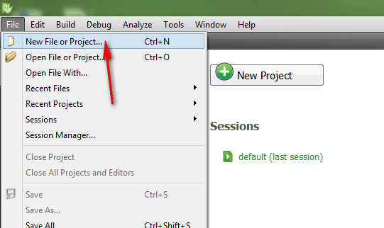
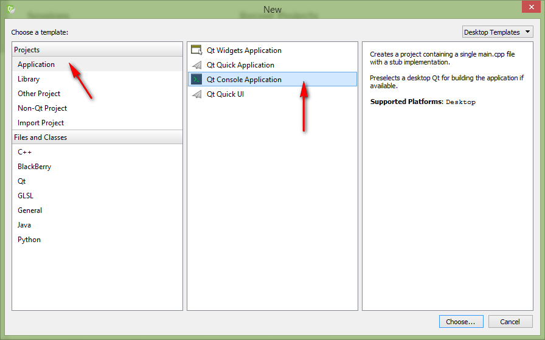
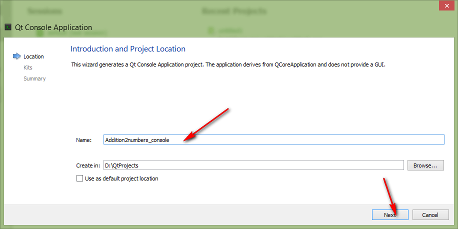
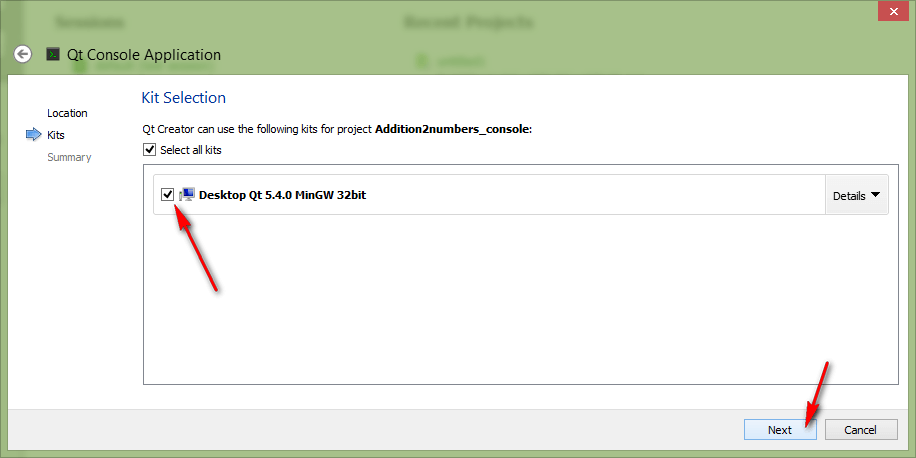
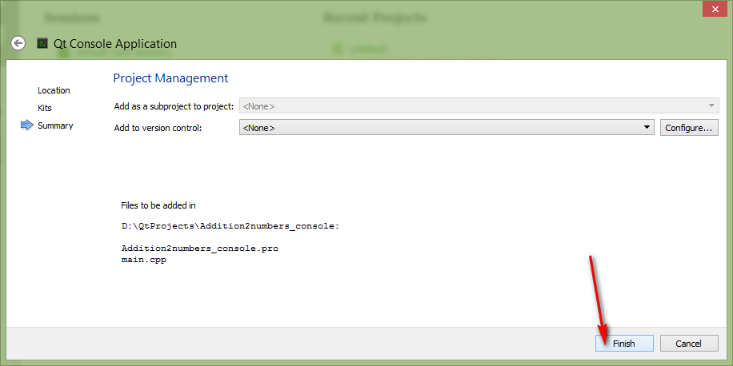
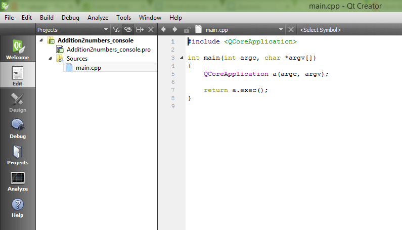
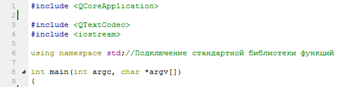
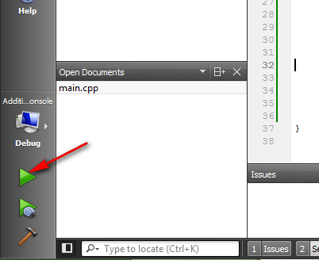
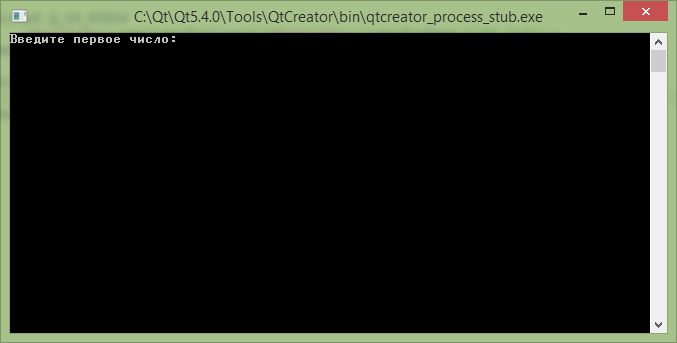
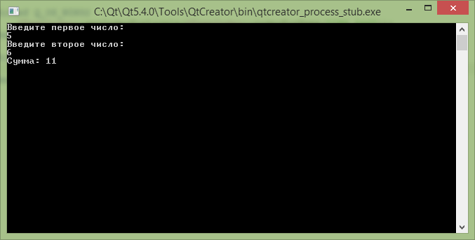

# Сложение двух чисел в Qt 5.4.0 на C++ (консольное приложение c moc компилятором)


В статье рассказывается, как создать консольное приложение сложения двух чисел в Qt 5.4.0 с использованием библиотеки Qt (то есть с использованием moc компилятора).

<details>
<summary>📖 Содержание</summary>

## Содержание

- [Приготовления](#приготовления)
- [Создание проекта](#создание-проекта)
- [Болванка приложения C++](#болванка-приложения-c)
- [Написание кода основной программы](#написание-кода-основной-программы)
- [Запуск программы](#запуск-программы)

</details>

В статье [Сложение двух чисел в Qt 5.12.0 на C++ (консольное приложение)](https://github.com/Harrix/harrix.dev-articles-2018/blob/main/add-2-num-qt-console/add-2-num-qt-console.md) | [🡥](https://harrix.dev/ru/articles/2018/add-2-num-qt-console/) рассказывается, как создать классическое консольное приложение в Qt без привлечения библиотек Qt.

## Приготовления

В статье [Установка Qt](https://github.com/Harrix/harrix.dev-articles-2018/blob/main/install-qt-mingw/install-qt-mingw.md) | [🡥](https://harrix.dev/ru/articles/2018/install-qt-mingw/) и в статье [Установка Qt под Visual Studio, MinGW и для разработки под Android](https://github.com/Harrix/harrix.dev-articles-2018/blob/main/install-qt-advanced/install-qt-advanced.md) | [🡥](https://harrix.dev/ru/articles/2018/install-qt-advanced/) узнаете, как всё установить и настроить.

## Создание проекта



_Рисунок 1 — Создание нового проекта_



_Рисунок 2 — Выбор типа нового проекта_



_Рисунок 3 — Выбор названия проекта_



_Рисунок 4 — Выбор компилятора_



_Рисунок 5 — Дополнительная настройка проекта_



_Рисунок 6 — Созданный проект_

## Болванка приложения C++

Пропишем подключение библиотек:

```cpp
#include <QTextCodec>
#include <iostream>
```

Пропишем пространство имен стандартной библиотеки, чтобы потом нужно было меньше прописывать кода:

```cpp
using namespace std;//Подключение стандартной библиотеки функций
```



_Рисунок 7 — Текущее состояние кода C++_

В функции `main` пропишем строчки кода, чтобы русский язык отображался корректно:

```cpp
#ifdef Q_OS_WIN32
    QTextCodec::setCodecForLocale(QTextCodec::codecForName("IBM 866"));
#endif

#ifdef Q_OS_LINUX
    QTextCodec::setCodecForLocale(QTextCodec::codecForName("UTF-8"));
#endif
```

В итоге получаем готовую болванку программы на C++:

```cpp
#include <QCoreApplication>

#include <QTextCodec>
#include <iostream>

using namespace std;//Подключение стандартной библиотеки функций

int main(int argc, char *argv[])
{
    QCoreApplication a(argc, argv);

#ifdef Q_OS_WIN32
    QTextCodec::setCodecForLocale(QTextCodec::codecForName("IBM 866"));
#endif

#ifdef Q_OS_LINUX
    QTextCodec::setCodecForLocale(QTextCodec::codecForName("UTF-8"));
#endif

  //Тут пишем код

    return a.exec();
}:
```

## Написание кода основной программы

А теперь пропишем основной код нашей программы, где через `cin` мы считываем в переменные наши числа, а через `cout` выводим текст в консоль:

```cpp
int x, y, z;

//Считаем первое число
cout << qPrintable("Введите первое число:") << endl;
cin >> x;

//Считаем второе число
cout << qPrintable("Введите второе число:") << endl;
cin >> y;

//Посчитаем сумму
z = x + y;

//Выведем результат
cout << qPrintable("Сумма:") << z << endl;
```

Полная программа будет выглядеть так:

```cpp
#include <QCoreApplication>
#include <QTextCodec>
#include <iostream>

using namespace std;//Подключение стандартной библиотеки функций

int main(int argc, char *argv[])
{
  QCoreApplication a(argc, argv);

#ifdef Q_OS_WIN32
    QTextCodec::setCodecForLocale(QTextCodec::codecForName("IBM 866"));
#endif

#ifdef Q_OS_LINUX
    QTextCodec::setCodecForLocale(QTextCodec::codecForName("UTF-8"));
#endif

    int x, y, z;

    //Считаем первое число
    cout << qPrintable("Введите первое число:") << endl;
    cin >> x;

    //Считаем второе число
    cout << qPrintable("Введите второе число:") << endl;
    cin >> y;

    //Посчитаем сумму
    z = x + y;

    //Выведем результат
    cout << qPrintable("Сумма:") << z << endl;

  return a.exec();
}
```

Теперь немного о коде получившемся. Из-за проблем с отображением русских букв в консоли в Qt5 нам приходится использовать костыль вида:

```cpp
cout << qPrintable("Введите второе число:") << endl;
```

Тогда как в классических консольных приложениях пишем так:

```cpp
cout << "Введите второе число:" << endl;
```

Если вы не хотите использовать русские буквы, то код будет чище и красивее:

```cpp
#include <QCoreApplication>

#include <iostream>

using namespace std;

int main(int argc, char *argv[])
{
    QCoreApplication a(argc, argv);

    int x, y, z;

    cout << "Input first number:" << endl;
    cin >> x;

    cout << "Input second number:" << endl;
    cin >> y;

    z = x + y;

    cout << "Sum: " << z << endl;

    return a.exec();
}
```

## Запуск программы



_Рисунок 8 — Запуск программы_

Получаем наше приложение:



_Рисунок 9 — Запущенное приложение_

При вводе наших чисел получим вот это:



_Рисунок 10 — Результат выполнения программы_
