# Сложение двух чисел в Qt 5.4.0 на C++


В статье рассказывается как создать приложение сложения двух чисел в Qt 5.4.0.

## Приготовления

В статье [Установка Qt](https://github.com/Harrix/harrix.dev-blog-2018/blob/main/install-qt-mingw/install-qt-mingw.md) и в статье [Установка Qt под Visual Studio, MinGW и для разработки под Android](https://github.com/Harrix/harrix.dev-blog-2018/blob/main/install-qt-advanced/install-qt-advanced.md) узнаете, как всё установить и настроить.

## Создание проекта

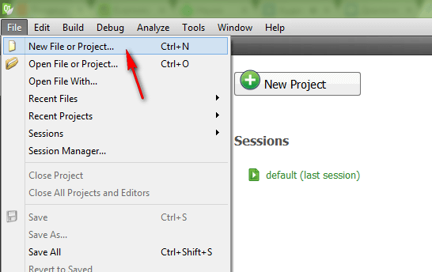

_Рисунок 1 — Создание нового проекта_

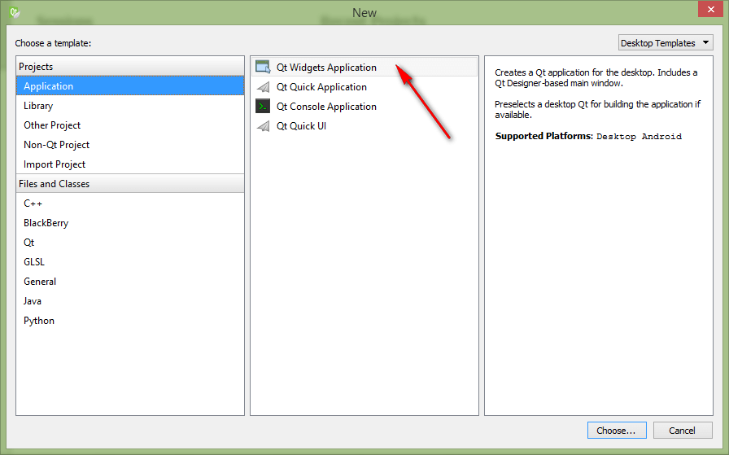

_Рисунок 2 — Выбор типа проекта_

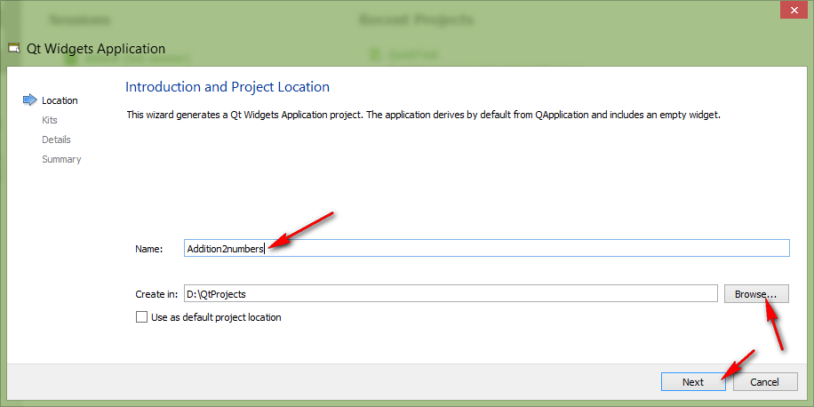

_Рисунок 3 — Выбор имени и папки проекта_

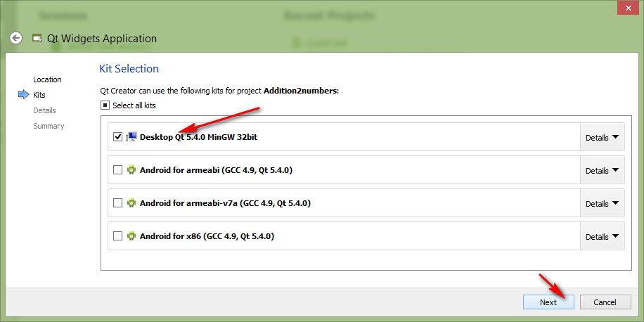

_Рисунок 4 — Выбор компилятора_

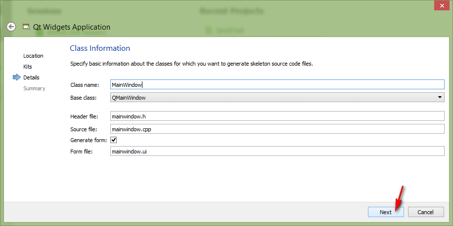

_Рисунок 5 — Выбор названий класса и главных файлов проекта_

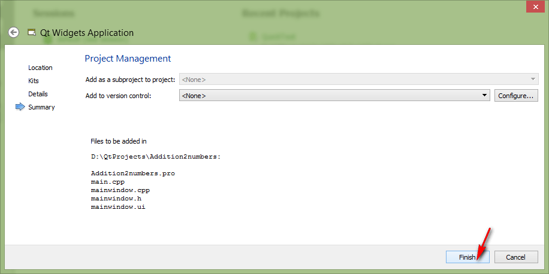

_Рисунок 6 — Дополнительная настройка проекта_

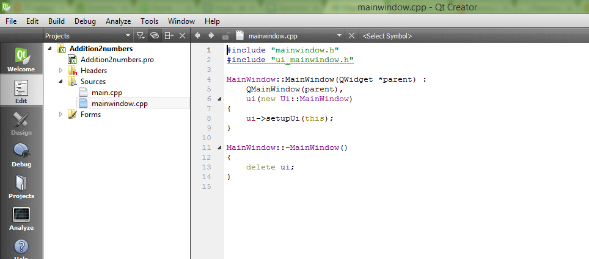

_Рисунок 7 — Созданный проект_

## Интерфейс приложения

Перейдем двойным кликом на форму:

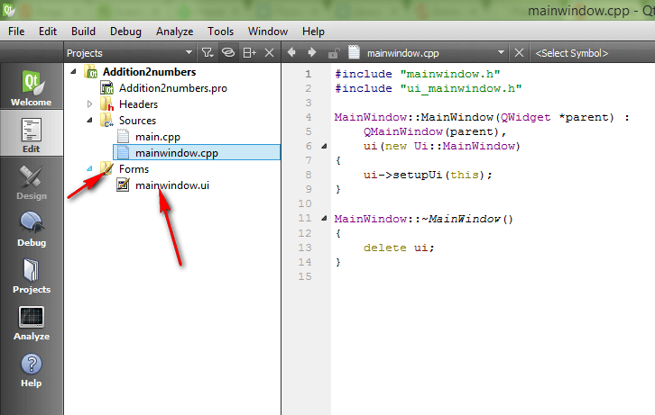

_Рисунок 8 — Переход на форму_

Перетащите два `QLineEdit` на форму, в которые будем записывать наши числа:

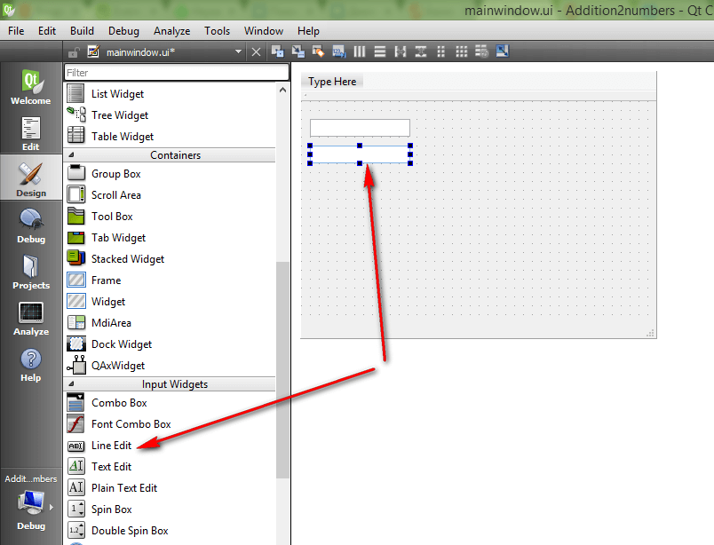

_Рисунок 9 — Перетаскивание на форму QLineEdit_

Перетащите кнопку на форму:

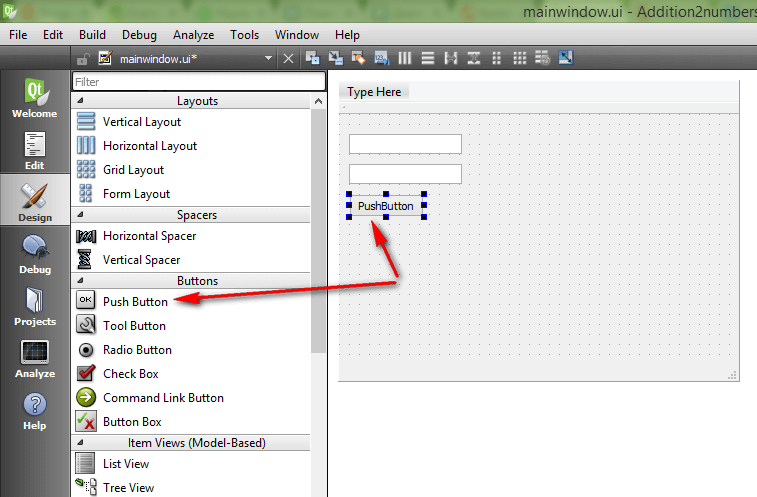

_Рисунок 10 — Перетаскивание на форму кнопки_

Перетащите `QTextView` на форму, в которую мы будем выводить информацию:

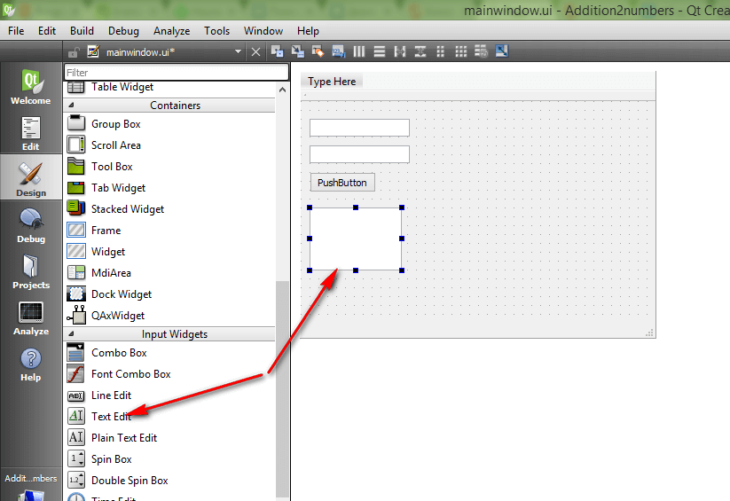

_Рисунок 11 — Перетаскивание на форму QTextView_

## Написание кода основной программы

Щелкнете по кнопке правой кнопкой и выберите `Goto slot…`:

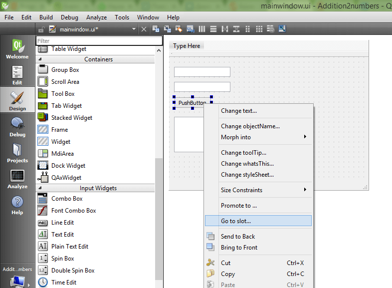

_Рисунок 12 — Переход к слоту кнопки_

Щелкаем `OK`:

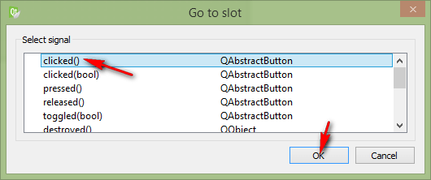

_Рисунок 13 — Выбор слота clicked_

Мы получили метод, в котором прописываем реакцию на клик нашей мыши:

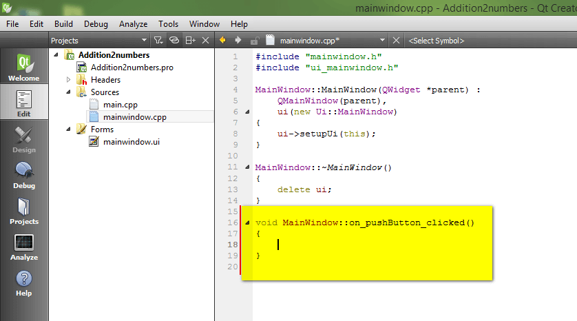

_Рисунок 14 — Метод слота в файле класса формы_

В фигурных скобках пропишем код нашей программы по считыванию двух чисел, их сложении и выводе результата:

```cpp
int x, y, z;

//Считаем значение из первого lineEdit
QString S1 = ui->lineEdit->text();
//Переведем значение в число
x = S1.toInt();

//Считаем значение из второго lineEdit
QString S2 = ui->lineEdit_2->text();
//Переведем значение в число
y = S2.toInt();

//Посчитаем сумму
z = x + y;

//Выведем результат
ui->textEdit->insertPlainText(QString::number(z));
```

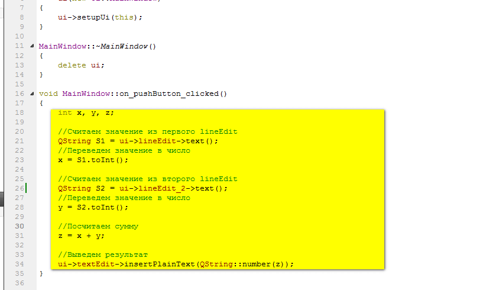

_Рисунок 15 — Исходный код программы_

Полная программа будет выглядеть так:

```cpp
#include "mainwindow.h"
#include "ui_mainwindow.h"

MainWindow::MainWindow(QWidget *parent) :
    QMainWindow(parent),
    ui(new Ui::MainWindow)
{
    ui->setupUi(this);
}

MainWindow::~MainWindow()
{
    delete ui;
}

void MainWindow::on_pushButton_clicked()
{
    int x, y, z;

    //Считаем значение из первого lineEdit
    QString S1 = ui->lineEdit->text();
    //Переведем значение в число
    x = S1.toInt();

    //Считаем значение из второго lineEdit
    QString S2 = ui->lineEdit_2->text();
    //Переведем значение в число
    y = S2.toInt();

    //Посчитаем сумму
    z = x + y;

    //Выведем результат
    ui->textEdit->insertPlainText(QString::number(z));
}
```

## Запуск программы

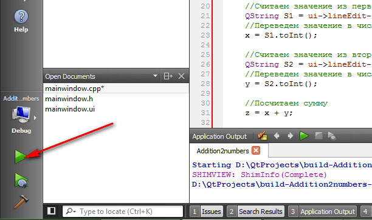

_Рисунок 16 — Запуск программы_

Получаем наше приложение:

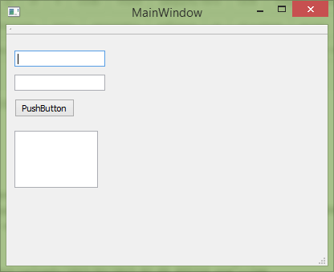

_Рисунок 17 — Запущенное приложение_

При вводе наших чисел получим вот это:

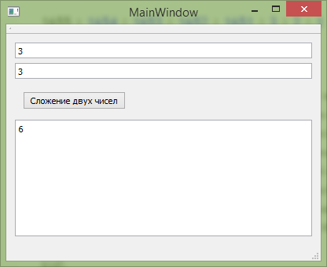

_Рисунок 18 — Результат выполнения программы_
