# Сложение двух чисел в Visual Studio 2013 на C++ (CLR приложение)


В статье рассказывается как создать CLR приложение сложения двух чисел в Visual Studio 2013 на C++.

<details>
<summary>📖 Содержание</summary>

## Содержание

- [Создание проекта](#создание-проекта)
- [Подготовка проекта](#подготовка-проекта)
- [Интерфейс приложения](#интерфейс-приложения)
- [Написание кода основной программы](#написание-кода-основной-программы)
- [Запуск программы](#запуск-программы)

</details>

## Создание проекта

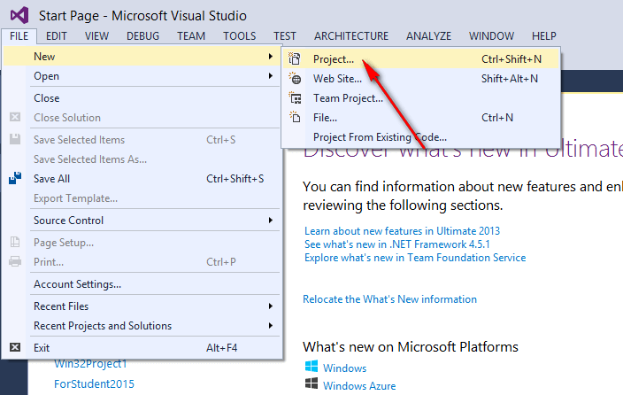

_Рисунок 1 — Создание нового проекта_

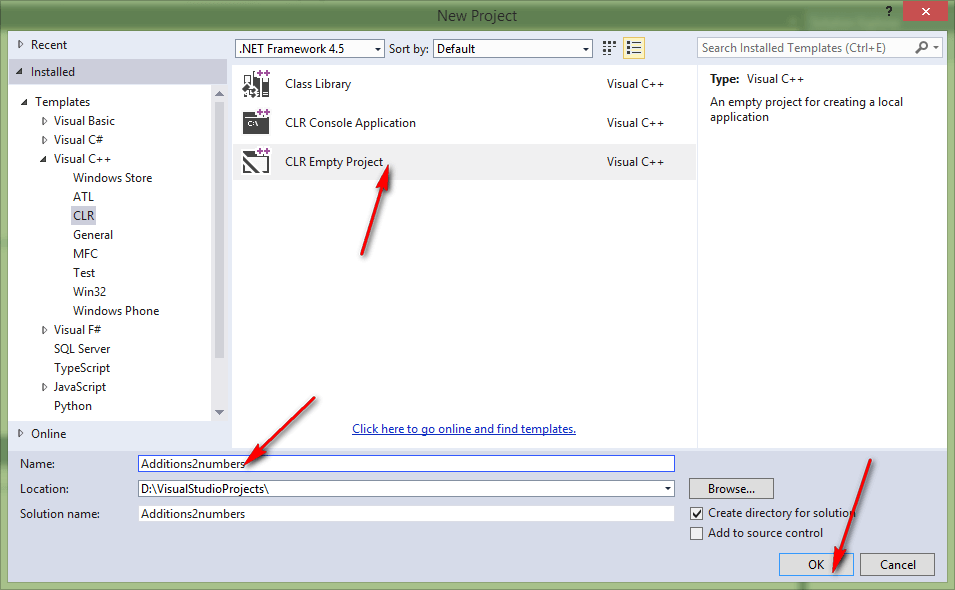

_Рисунок 2 — Выбор типа проекта_

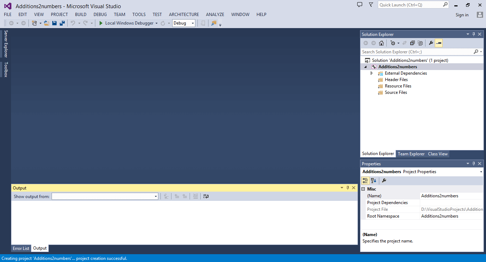

_Рисунок 3 — Созданный проект_

## Подготовка проекта

В отличии от Visual Studio 2010 тут CLR приложения создаются пустыми без формы. Зачем они это сделали — непонятно. Будем добавлять форму самостоятельно.

Щелкаем по проекту правой кнопкой и следуем иллюстрациям:

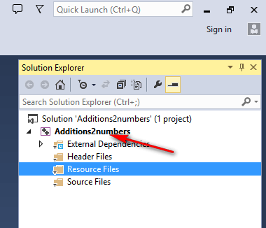

_Рисунок 4 — Клик правой кнопкой по проекту_

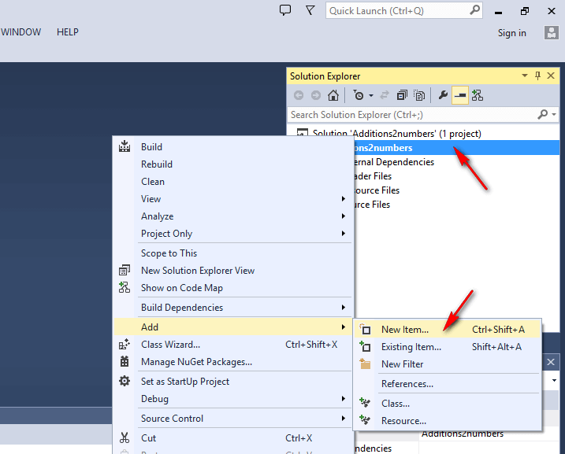

_Рисунок 5 — Добавление нового элемента_

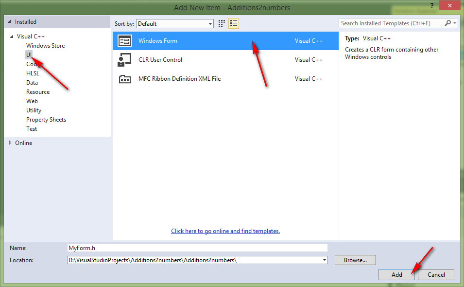

_Рисунок 6 — Добавление новой формы_

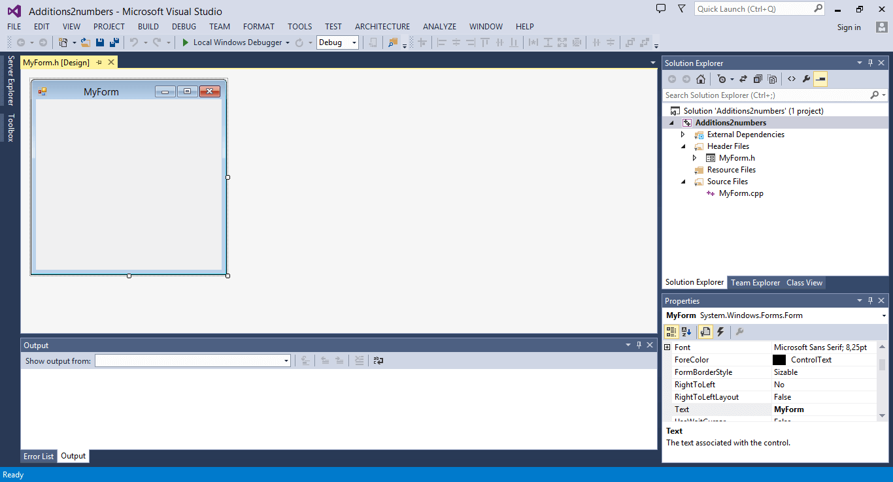

_Рисунок 7 — Созданная форма_

Далее перейдем в файл `cpp` нашей формы:

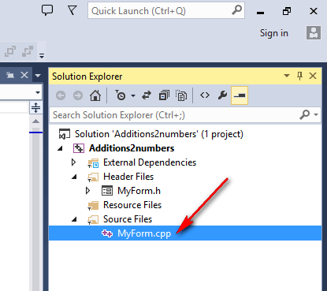

_Рисунок 8 — Переход в исходный файл формы_

Допишем там вот такой код после единственной строчки:

```cpp
using namespace System;
using namespace System::Windows::Forms;

[STAThread]
void Main(array<String^>^args)
{
  Application::EnableVisualStyles();
  Application::SetCompatibleTextRenderingDefault(false);

  Additions2numbers::MyForm form;
  Application::Run(%form);
}:
```

**Внимание!** Обратите внимание, что `Additions2numbers` — это название вашего проекта в коде выше. Поэтому, если ваш проект называется по-другому, то вставьте своё название проекта:

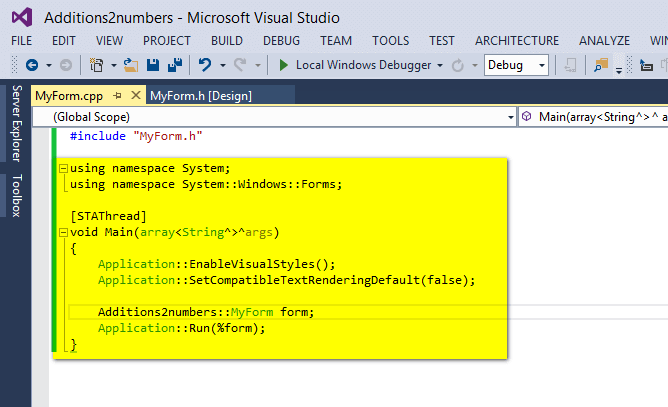

_Рисунок 9 — Внешний вид кода программы_

Щелкнем по проекту правой кнопкой и перейдем в его свойства:

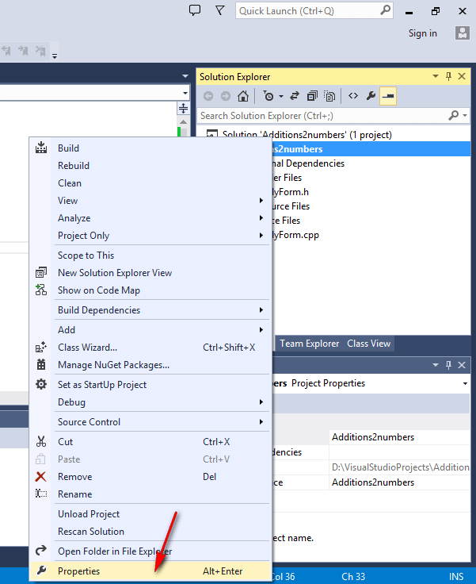

_Рисунок 10 — Выбор свойств проекта_

В настройках компоновщика нужно в двух местах поменять настройки:

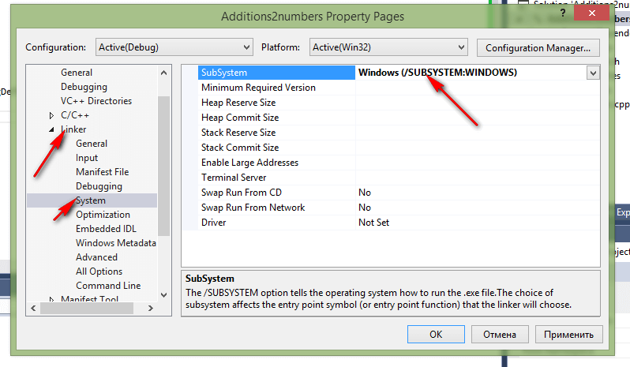

_Рисунок 11 — Настройки компоновщика_

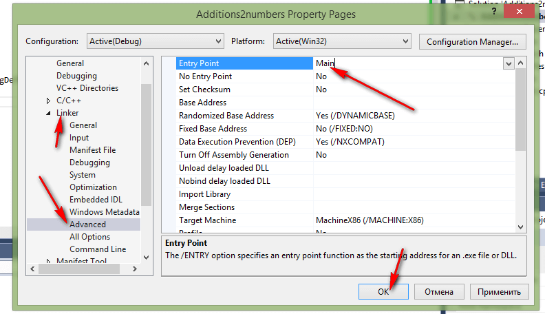

_Рисунок 12 — Редактирование точки входа приложения_

Жмем `OK`, и мы закончили прикручивать форму к нашему приложению.

Можете запустить приложение и проверить работоспособность. Если приложение скомпилируется и запустится, то всё норм. Иначе проверьте все шаги до этого:

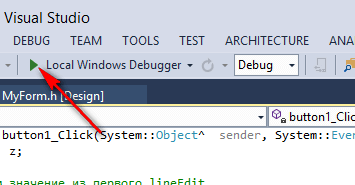

_Рисунок 13 — Запуск приложения_

## Интерфейс приложения

Перейдем на форму. Можно сделать двумя способами:

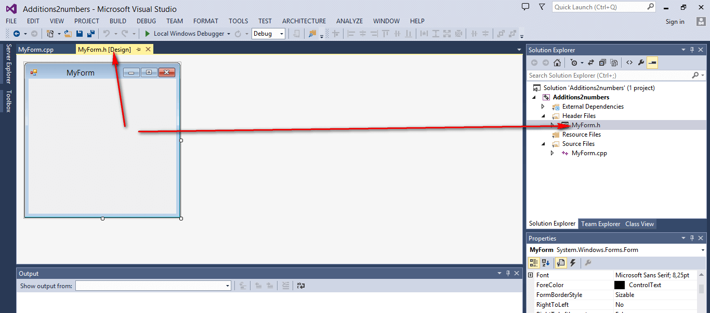

_Рисунок 14 — Переход на форму_

Обратите внимание, что код кнопок и сама форма прописывается в `h` файле, а не `cpp`.

Перетащите два `textBox` на форму, в которые будем записывать наши числа:

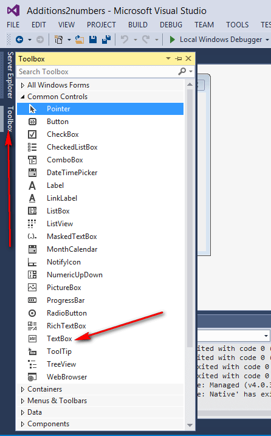

_Рисунок 15 — Перетаскивание textBox_

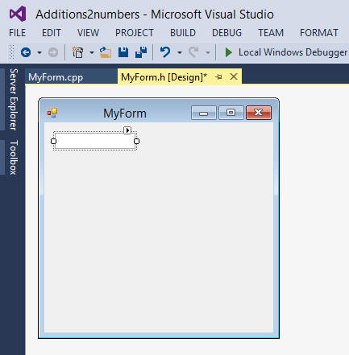

_Рисунок 16 — Первый textBox_

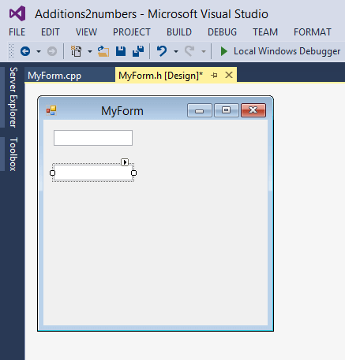

_Рисунок 17 — Второй textBox_

Перетащите кнопку на форму:

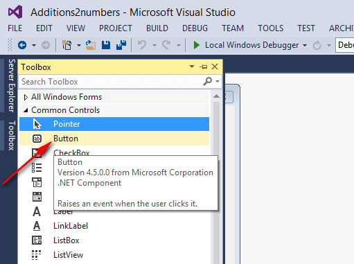

_Рисунок 18 — Перетаскивание кнопки_

Перетащите третий `textBox` на форму, в которую мы будем выводить информацию:

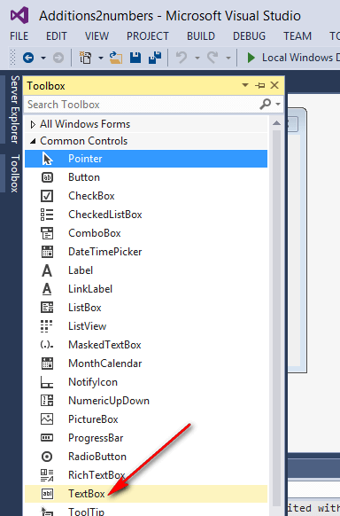

_Рисунок 19 — Перетаскивание textBox_

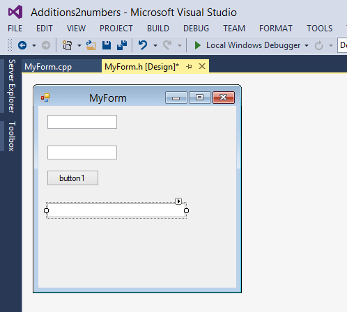

_Рисунок 20 — Третий textBox_

Однострочные и многострочные текстовые поля задаются одним компонентом. Поэтому мы должны изменить параметры нашего `textBox3`, чтобы в нем можно было выводить много строк. Выделим наш `textBox3` и изменим его параметры:

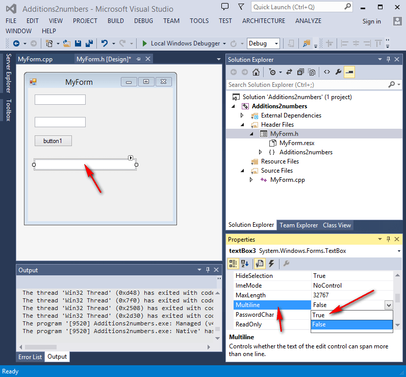

_Рисунок 21 — Изменение свойства Multiline на true_

Теперь мы можем его растянуть вниз:

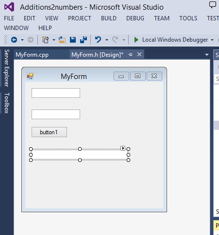

_Рисунок 22 — Начальные размеры textBox_

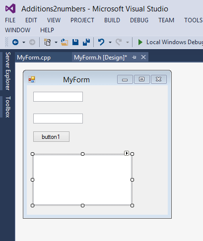

_Рисунок 23 — Конечные размеры textBox_

## Написание кода основной программы

Щелкнете по кнопке двойным кликом:

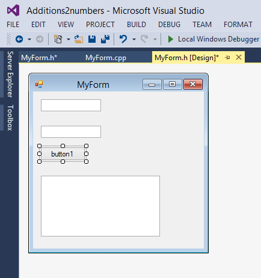

_Рисунок 24 — Двойной клик по кнопке_

Мы получили метод, в котором прописываем реакцию на клик нашей мыши:

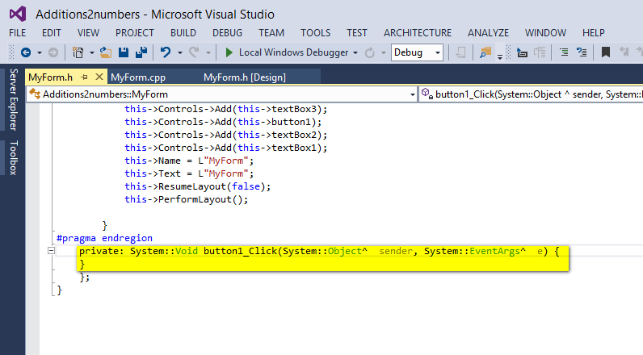

_Рисунок 25 — Созданный метод обработки клика кнопки_

В фигурных скобках пропишем код нашей программы по считыванию двух чисел, их сложении и выводе результата:

```cpp
int x, y, z;

//Считаем значение из первого lineEdit
String^ S1 = textBox1->Text;
//Переведем значение в число
x = Convert::ToInt32(S1);

//Считаем значение из второго lineEdit
String^ S2 = textBox2->Text;
//Переведем значение в число
y = Convert::ToInt32(S2);

//Посчитаем сумму
z = x + y;

//Выведем результат
textBox3->Text = z.ToString();
```

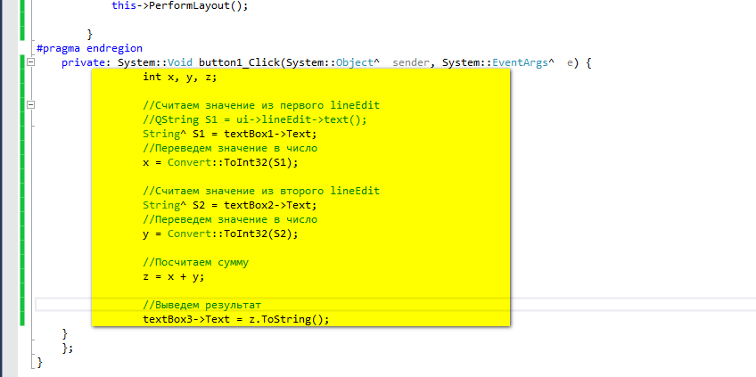

_Рисунок 26 — Код в методе обработки клика кнопки_

## Запуск программы

Немного поменял размеры компонентов и изменил текст на кнопке. Поэтому ниже на скринах компоненты чуть по-другому будут выглядеть:

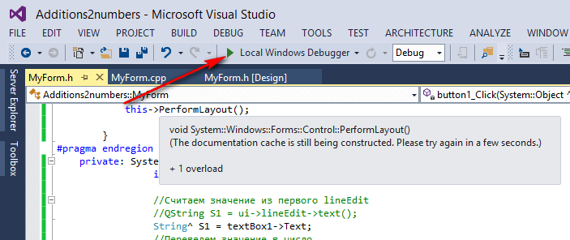

_Рисунок 27 — Запуск приложения_

Получаем наше приложение:

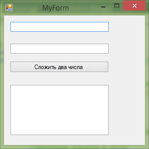

_Рисунок 28 — Запущенное приложение_

При вводе наших чисел получим вот это:

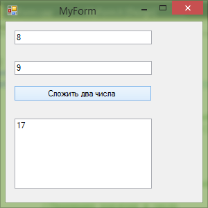

_Рисунок 29 — Результат выполнения приложения_
