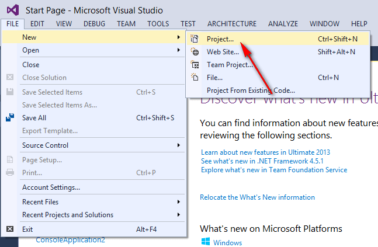
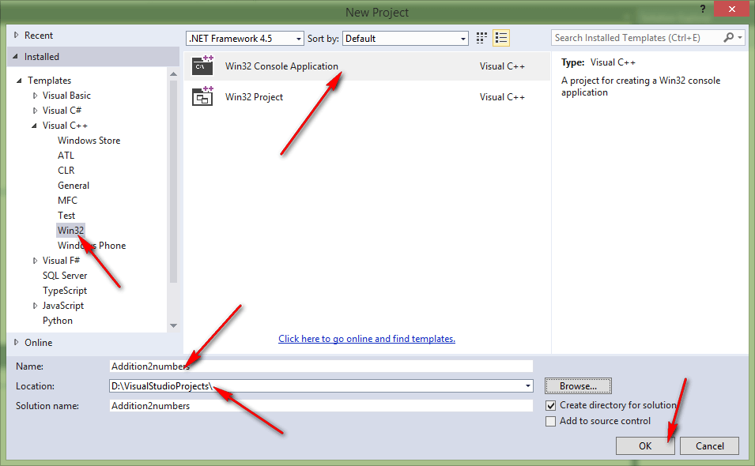
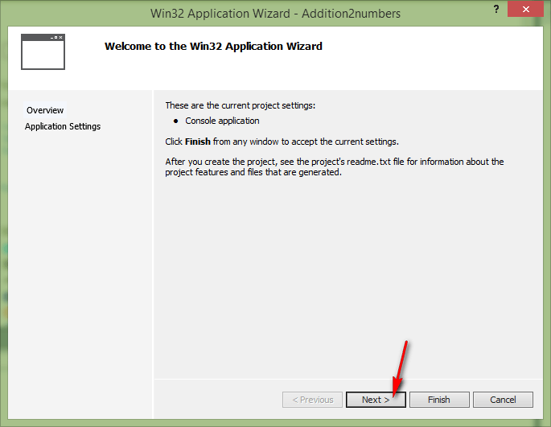
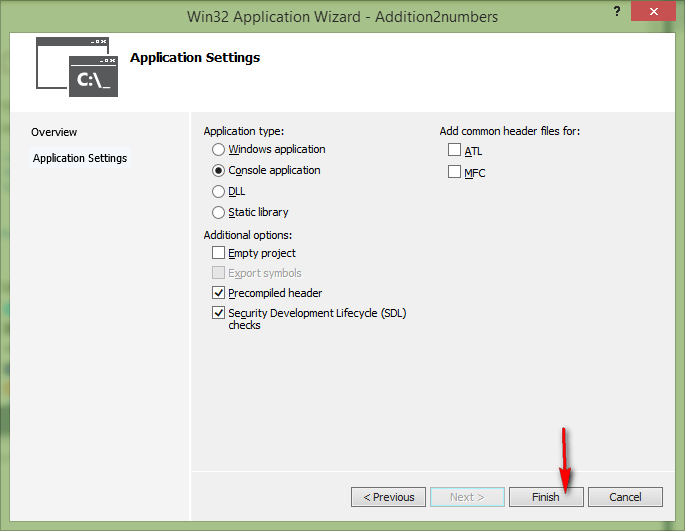
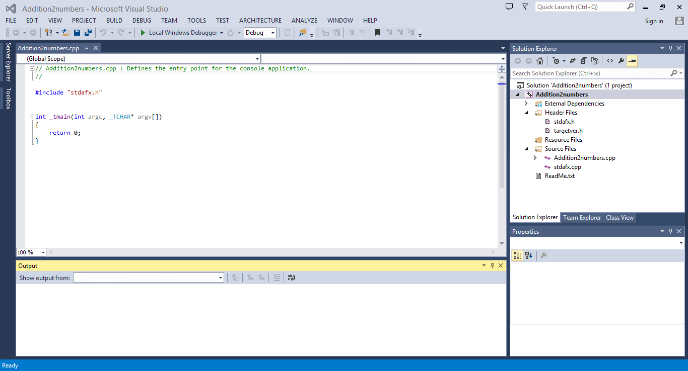
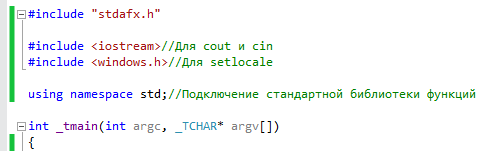
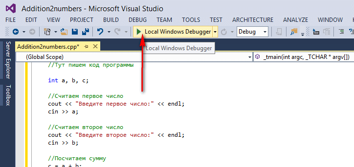
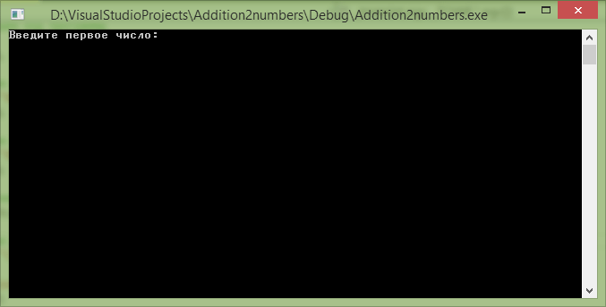
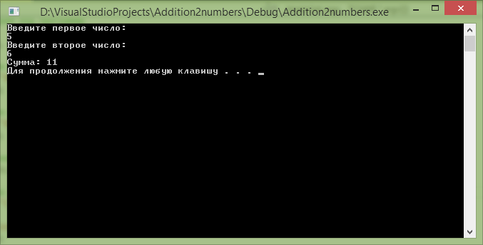

# Сложение двух чисел в Visual Studio 2013 (консольное Win32 приложение)


В статье рассказывается как создать консольное приложения сложения двух чисел Win32 в Visual Studio 2013.

## Содержание

- [Создание проекта](#создание-проекта)
- [Болванка приложения C++](#болванка-приложения-c)
- [Написание кода основной программы](#написание-кода-основной-программы)
- [Запуск программы](#запуск-программы)

## Создание проекта



_Рисунок 1 — Создание нового проекта_



_Рисунок 2 — Выбор типа нового проекта_



_Рисунок 3 — Мастер создания проекта_



_Рисунок 4 — Мастер создания проекта_



_Рисунок 5 — Созданный новый проект_

## Болванка приложения C++

Пропишем подключение библиотек:

```cpp
#include <iostream>//Для cout и cin
#include <windows.h>//Для setlocale
```

Пропишем пространство имен стандартной библиотеки, чтобы потом было меньше прописывать кода:

```cpp
using namespace std;//Подключение стандартной библиотеки функций
```



_Рисунок 6 — Внешний вид кода_

В функции `_tmain` пропишем строчки кода, чтобы русский язык отображался корректно:

```cpp
setlocale(LC_ALL, "RUSSIAN");//Для корректного отображения русского языка
//Раскомментировать строчки ниже, если с русским будут проблемы
//setlocale(LC_ALL, "ru_RU.UTF-8");
//setlocale(LC_ALL, "");
```

В конце функции перед `return` пропишем функцию, чтобы программа автоматически не закрывалась:

```cpp
system("pause");//Чтобы приложение не закрылось автоматически
```

В итоге получаем болванку программы на C++, которую потом удобно использовать для других приложений учебного толка:

```cpp
// Addition2numbers.cpp : Defines the entry point for the console application.
//

#include "stdafx.h"

#include <iostream>//Для cout и cin
#include <windows.h>//Для setlocale

using namespace std;//Подключение стандартной библиотеки функций

int _tmain(int argc, _TCHAR* argv[])
{
  setlocale(LC_ALL, "RUSSIAN");//Для корректного отображения русского языка
  //Раскомментировать строчки ниже, если с русским будут проблемы
  //setlocale(LC_ALL, "ru_RU.UTF-8");
  //setlocale(LC_ALL, "");

  //Тут пишем код программы

  system("pause");//Чтобы приложение не закрылось автоматически
  return 0;
}
```

## Написание кода основной программы

А теперь пропишем основной код нашей программы, где через `cin` мы считываем в переменные наши числа, а через `cout` выводим текст в консоль:

```cpp
int a, b, c;

//Считаем первое число
cout << "Введите первое число:" << endl;
cin >> a;

//Считаем второе число
cout << "Введите второе число:" << endl;
cin >> b;

//Посчитаем сумму
c = a + b;

//Выведем результат
cout << "Сумма: " << c << endl;
```

Полная программа будет выглядеть так:

```cpp
// Addition2numbers.cpp : Defines the entry point for the console application.
//

#include "stdafx.h"

#include <iostream>//Для cout и cin
#include <windows.h>//Для setlocale

using namespace std;//Подключение стандартной библиотеки функций

int _tmain(int argc, _TCHAR* argv[])
{
  setlocale(LC_ALL, "RUSSIAN");//Для корректного отображения русского языка
  //Раскомментировать строчки ниже, если с русским будут проблемы
  //setlocale(LC_ALL, "ru_RU.UTF-8");
  //setlocale(LC_ALL, "");

  //Тут пишем код программы

  int a, b, c;

  //Считаем первое число
  cout << "Введите первое число:" << endl;
  cin >> a;

  //Считаем второе число
  cout << "Введите второе число:" << endl;
  cin >> b;

  //Посчитаем сумму
  c = a + b;

  //Выведем результат
  cout << "Сумма: " << c << endl;

  system("pause");//Чтобы приложение не закрылось автоматически
  return 0;
}
```

## Запуск программы



_Рисунок 7 — Запуск приложения_

Получаем наше приложение:



_Рисунок 8 — Запущенное приложение_

При вводе наших чисел получим вот это:



_Рисунок 9 — Вывод программы_
