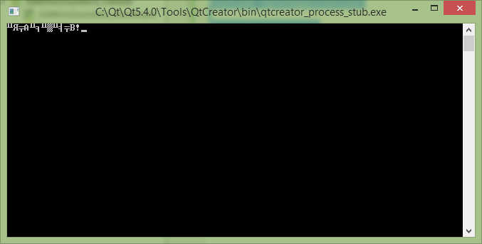
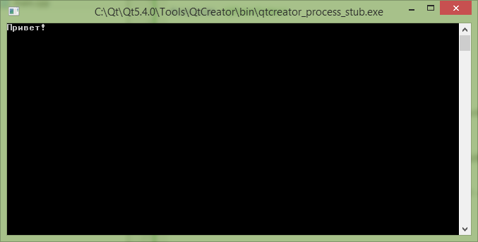

# Русские буквы в консольных приложениях Qt


В статье рассказывается об одном костыле для отображения русских букв в консольных приложениях Qt. В статье рассматривается приложение на основе Qt 5.4.0.

<details>
<summary>📖 Содержание</summary>

## Содержание

- [Решение для Qt консольных приложениях](#решение-для-qt-консольных-приложениях)
- [Решение для классических консольных приложениях](#решение-для-классических-консольных-приложениях)

</details>

В Qt версии 5 и выше поменялись некоторые настройки и стандартные костыли по отображению русских букв в консоли не работают.

Суть проблемы. В стандартной консольной программе вместо русского текста будет выведены крякозябры:

```cpp
#include <QCoreApplication>

#include <iostream>

using namespace std;

int main(int argc, char *argv[])
{
    QCoreApplication a(argc, argv);

    cout << "Привет!";

    return a.exec();
}:
```



_Рисунок 1 — Проблема с кодировкой_

## Решение для Qt консольных приложениях

Прописываем нужные кодировки:

```cpp
#ifdef Q_OS_WIN32
    QTextCodec::setCodecForLocale(QTextCodec::codecForName("IBM 866"));
#endif

#ifdef Q_OS_LINUX
    QTextCodec::setCodecForLocale(QTextCodec::codecForName("UTF-8"));
#endif
```

Нужно будет еще подключить:

```cpp
#include <QTextCodec>
```

А текст отображаем в виде костыля:

```cpp
qPrintable("Текст")
```

Программа в итоге будет выглядеть так:

```cpp
#include <QCoreApplication>

#include <iostream>

#include <QTextCodec>

using namespace std;

int main(int argc, char *argv[])
{
    QCoreApplication a(argc, argv);

#ifdef Q_OS_WIN32
    QTextCodec::setCodecForLocale(QTextCodec::codecForName("IBM 866"));
#endif

#ifdef Q_OS_LINUX
    QTextCodec::setCodecForLocale(QTextCodec::codecForName("UTF-8"));
#endif

    cout << qPrintable("Привет!");

    return a.exec();
}:

```



_Рисунок 2 — Запущенное приложение_

## Решение для классических консольных приложениях

Если вы работаете в Qt Creator с обычными консольными приложениями без использования moc компилятора Qt (например, при создании приложения выбрали Non-Qt project), то тут всё работает через `setlocale`:

```cpp
#include <iostream>

using namespace std;

int main()
{
  setlocale(LC_ALL, "ru_RU.UTF-8");

  cout << "Привет!";

  return 0;
}
```
