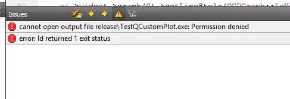
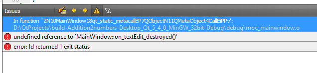
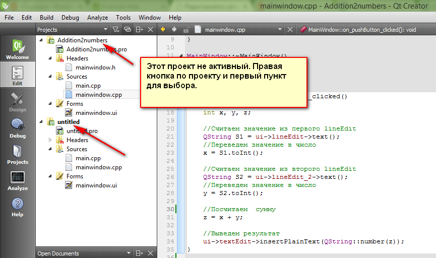
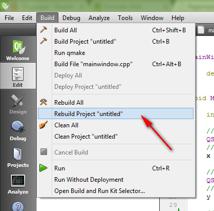
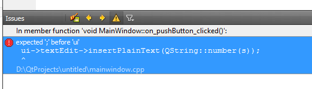

# Распространенные ошибки в Qt у начинающих


В процессе преподавания программированию на Qt наработал порцию стандартных ошибок, которые допускают студенты. Ниже представлены некоторые из них.

- [Забыли закрыть программу](#забыли-закрыть-программу)
- [Забыли удалить объявление метода](#забыли-удалить-объявление-метода)
- [Редактируемый проект не активный](#редактируемый-проект-не-активный)
- [Обнуляйте переменные](#обнуляйте-переменные)
- [Не во всех строчках в конце стоит точка с запятой](#не-во-всех-строчках-в-конце-стоит-точка-с-запятой)
- [Не забывайте точку с запятой](#не-забывайте-точку-с-запятой)

## Забыли закрыть программу

```shell
error: ld returned 1 exit status
```



_Рисунок 1 — Ошибка «error: ld returned 1 exit status»_

Если возникает такая ошибка, то вы забыли закрыть запущенное приложение. Qt пытается создать новый EXE файл, но так как открыта старая версия, то вылезает ошибка.

## Забыли удалить объявление метода

```shell
error: undefined reference to `MainWindow::on_textEdit_destroyed()'
```



_Рисунок 2 — Ошибка «error: undefined reference…»_

Если возникает такая ошибка (или подобного типа), то вы перешли к слоту какого-то объекта (в данном слоте `textEdit`), создали метод, он вам не понравился, и вы его удалили.

Но метод объявлен был еще в `mainwindow.h`, и оттуда вы объявление не удалили. Удалите:

![Объявление метода тоже нужно удалить(img/error-undefined-reference-2.png)

## Редактируемый проект не активный

Иногда возникает проблема. Вы редактируете проект, компилируете проект, но вместо вашей программы вылезает другая программа.

Проверьте, является ли ваш редактируемый проект активным или нет:



_Рисунок 3 — Необходимый проект неактивный_

Если проект активный, но всё равно изменения не отражаются на компилируемом приложении, то перестройте проект:



_Рисунок 4 — Попытка перестроить проект_

## Обнуляйте переменные

Вы запрограммировали код нахождения суммы чисел:

```cpp
int s;
for (int i=0;i<10;i++)
    s=s+i;

ui->textEdit->insertPlainText(QString::number(s));
```

Но он выдает громадные числа, например: `2686553`.

В C++ переменные хранят мусор после своего создания, они не равны нулю по умолчанию. А если к мусору прибавить число, то получится мусор. Вот правильный код:

```cpp
int s=0;
for (int i=0;i<10;i++)
    s=s+i;

ui->textEdit->insertPlainText(QString::number(s));
```

## Не во всех строчках в конце стоит точка с запятой

Решили найти сумму чисел:

```cpp
int s=0;
for (int i=0;i<10;i++);
    s=s+i;

ui->textEdit->insertPlainText(QString::number(s));
```

А при компилировании вылетает ошибка: `error: name lookup of 'i' changed for ISO 'for' scoping [-fpermissive]`.

В циклах и условиях в конце строчки точка с запятой не ставится. Вот правильный код:

```cpp
int s=0;
for (int i=0;i<10;i++)
    s=s+i;

ui->textEdit->insertPlainText(QString::number(s));
```

## Не забывайте точку с запятой

```cpp
int s=0;
for (int i=0;i<10;i++)
    s=s+i

ui->textEdit->insertPlainText(QString::number(s));
```



_Рисунок 5 — Ошибка при отсутствии точки запятой_

А вот в других случаях точка с запятой нужна. И если ошибка выдается такая: `error: expected ';' before`, то в предыдущей строке вы забыли точку с запятой. Вот правильный код:

```cpp
int s=0;
for (int i=0;i<10;i++)
    s=s+i;

ui->textEdit->insertPlainText(QString::number(s));
```
