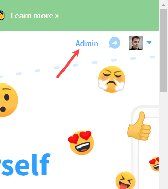
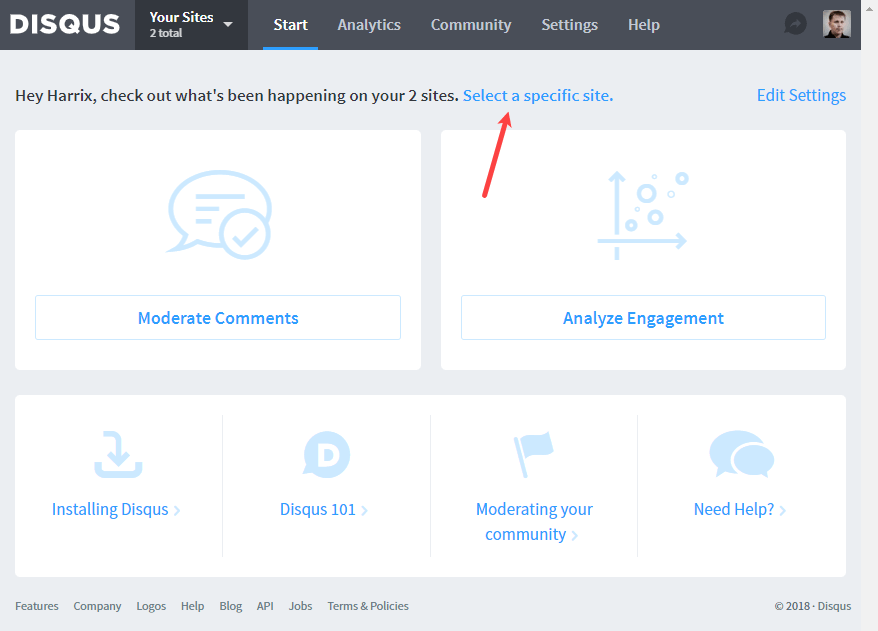
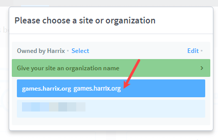
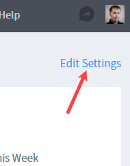
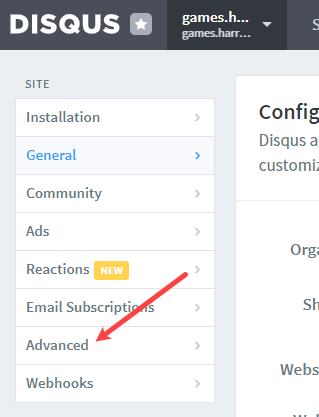
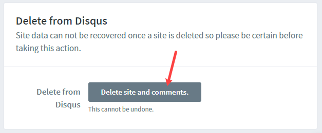
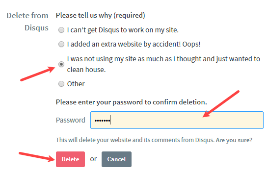

# Как удалить из disqus канал своего сайта

Система disqus замечательна как система комментариев, но иногда сайты устаревают, и хочется удалить сообщество (канал) на disqus.

Заходим на сайт <https://disqus.com/>.

Там справа наверху есть настройки. Там переходим в админку:

_Рисунок 1 — Переход в административную панель_

Выбираем конкретное сообщество, если у нас их несколько:

_Рисунок 2 — Переход к выбору сайта_

_Рисунок 3 — Выбор сайта_

Переходим в настройки сообщества:

_Рисунок 4 — Настройки системы комментариев сайта_

Далее переходим в расширенные настройки:

_Рисунок 5 — Переход в расширенные настройки_

И в самом конце настроек будет функция удаления сообщества:

_Рисунок 6 — Команда удаления сообщества_

_Рисунок 7 — Ввод пароля и выбор причины удаления_

Ваш канал-сообщество удален.
