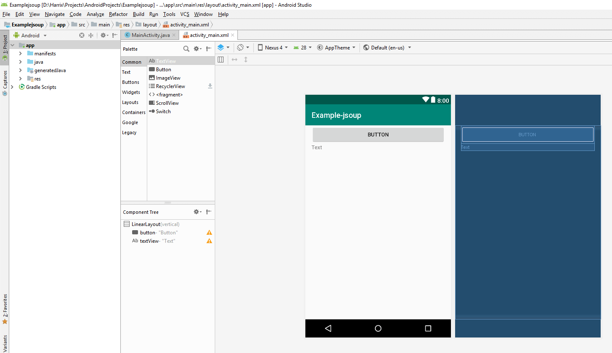
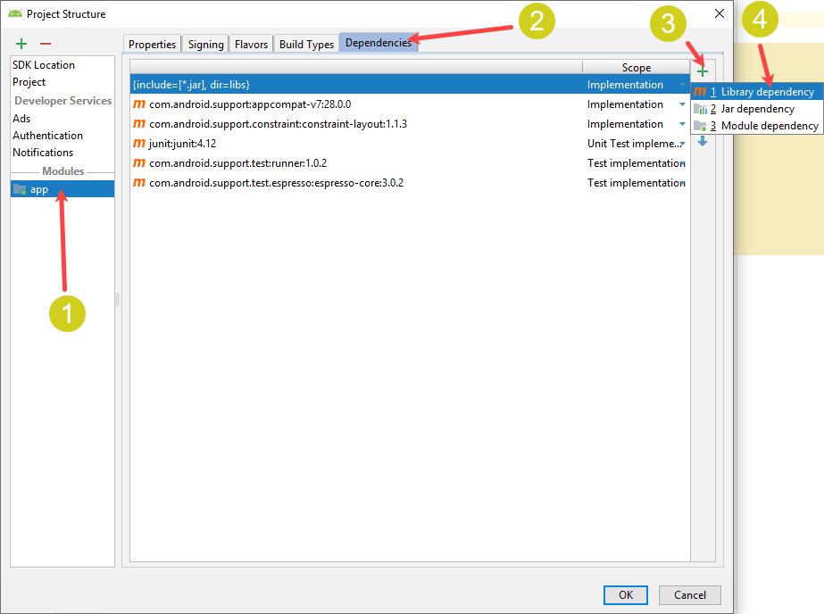
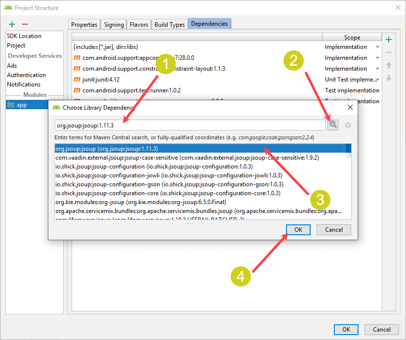
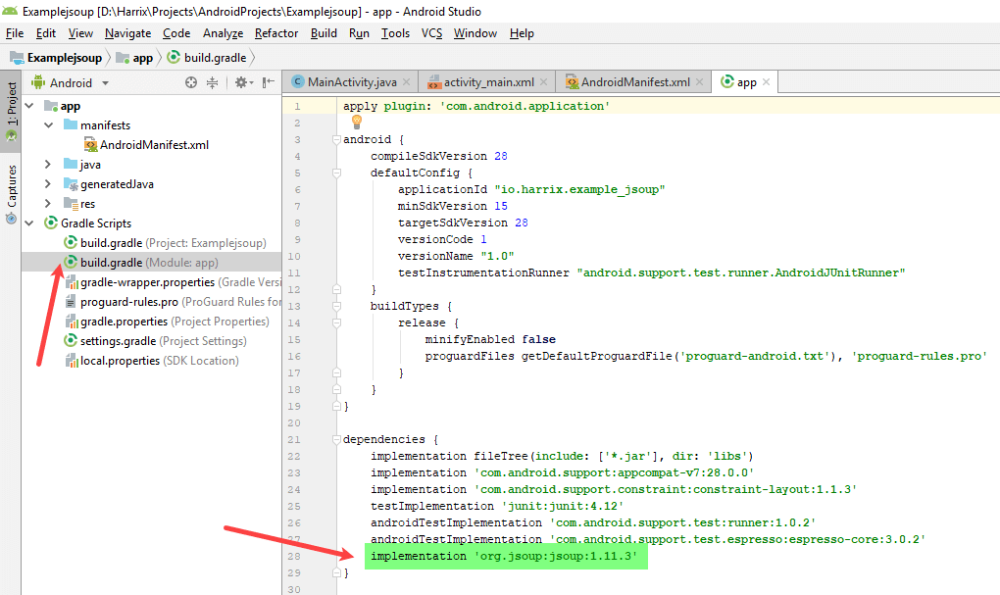
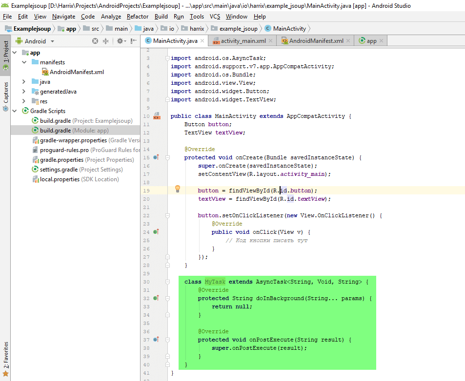
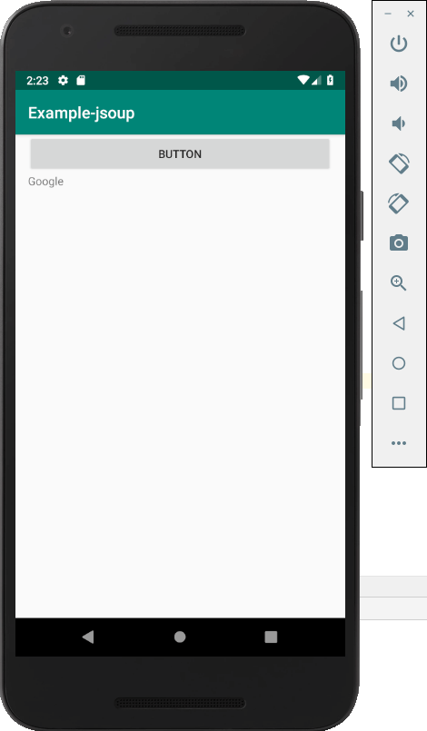

# Пример подключения jsoup в Android Studio

В статье показан пример создания приложения с библиотекой jsoup для парсера HTML кода.

Библиотека [jsoup](https://jsoup.org/) — наиболее известный инструмент для парсинга и разбора HTML кода в Android приложениях. То есть мы можем открыть какой-то сайт, но не для отображения в браузере, а получить именно код данной страницы и легко по нему искать нужную нам информацию.

## Создание проекта

Для примера создал простое Android приложение на основе `Empty Activity`, где на активности располагается одна кнопка и текстовое поле для вывода информации.

В коде `MainActivity.java` связал кнопку и текстовое поле с XML кнопкой и текстовым полем, а также назначил слушателя на клик кнопки. В общем, получилась классическая болванка для тестирования.

Файл `activity_main.xml`:

```xml
<?xml version="1.0" encoding="utf-8"?>
<LinearLayout xmlns:android="http://schemas.android.com/apk/res/android"
    android:layout_width="match_parent"
    android:layout_height="match_parent"
    android:paddingLeft="16dp"
    android:paddingRight="16dp"
    android:orientation="vertical" >

    <Button
        android:id="@+id/button"
        android:layout_width="match_parent"
        android:layout_height="wrap_content"
        android:text="Button" />

    <TextView
        android:id="@+id/textView"
        android:layout_width="match_parent"
        android:layout_height="wrap_content"
        android:text="Text" />
</LinearLayout>
```

Файл `MainActivity.java` (напоминаю, что первую строчку с package копировать не нужно: нужно оставить такую, какая есть у вас):

```java
package io.harrix.example_jsoup;

import androidx.appcompat.app.AppCompatActivity;
import android.os.Bundle;
import android.view.View;
import android.widget.Button;
import android.widget.TextView;

public class MainActivity extends AppCompatActivity {
    Button button;
    TextView textView;

    @Override
    protected void onCreate(Bundle savedInstanceState) {
        super.onCreate(savedInstanceState);
        setContentView(R.layout.activity_main);

        button = findViewById(R.id.button);
        textView = findViewById(R.id.textView);

        button.setOnClickListener(new View.OnClickListener() {
            @Override
            public void onClick(View v) {
                // Код кнопки писать тут
            }
        });
    }
}
```

Строчка с `package`, разумеется, у вас будет своей.

Внешний вид приложения в Android Studio:



## Настройка разрешений проекта

Для работы с интернетом нам нужно разрешение на это. Для этого нужно отредактировать `AndroidManifest.xml` и в нем добавить строчку:

```xml
<uses-permission android:name="android.permission.INTERNET" />
```


## Подключение библиотеки jsoup

Есть два способа подключения библиотеки. В первом случае мы вручную прописываем в `build.gradle (Module: app)` соответствующую библиотеку:

```json
implementation 'org.jsoup:jsoup:1.12.1'
```

Но в момент вашего прочтения этой статьи библиотека может многократно обновиться. Так что её текущую версию можно на [сайте](https://jsoup.org/) посмотреть или подключить через специальный инструмент, который ниже и рассмотрим.

Идем в главное меню `File` → `Project structure`. Там в разделе `Modules` находим добавление библиотеки:



В появившемся окне вводим `jsoup`, нажимаем на кнопку поиска и добавляем последнюю версию библиотеки:



В общем, любым из двух способов, в файле появится строчка с нашей библиотекой, а Gradle в проекте перестроит себя:



## Работа с jsoup

Так как у нас будет осуществляться работа с интернетом, то будет нужен второй поток, чтобы эту работу производить там. Для этого будем использовать `AsyncTask`.

В экземпляр `AsyncTask` будем передавать адрес нужного сайта, а извлекать для примера будет заголовок этого же сайта. И оба эти параметра у нас будут типа `String`.

Поэтому нам потребуется `AsyncTask` такого вида:

```java
class MyTask extends AsyncTask<String, Void, String> {
    @Override
    protected String doInBackground(String... params) {
        return null;
    }

    @Override
    protected void onPostExecute(String result) {
        super.onPostExecute(result);
    }
}
```



В методе `doInBackground` будет прописана главная работа библиотеки `jsoup`:

```java
@Override
protected String doInBackground(String... params) {
    // params - это массив входных параметров
    // в params[0] будет хранится адрес сайта, который мы парсим

    String title; // Тут храним значение заголовка сайта

    Document doc = null; // Здесь хранится будет разобранный HTML документ
    try {
        // Считываем заглавную страницу
        doc = Jsoup.connect(params[0]).get();
    } catch (IOException e) {
        // Если не получилось считать
        e.printStackTrace();
    }

    // Если всё считалось, что вытаскиваем из считанного HTML документа заголовок
    if (doc != null)
        title = doc.title();
    else
        title = "Error";

    // Передаем в метод onPostExecute считанный заголовок
    return title;
}
```

Так как метод `onPostExecute` в классе `AsyncTask` выполняется уже в главном потоке, а его входные параметры — это выходные параметры метода `doInBackground`, то в `onPostExecute` можем отобразить полученный заголовок:

```java
@Override
protected void onPostExecute(String result) {
    super.onPostExecute(result);

    textView.setText(result);
}
```

Теперь остается только создать экземпляр нашего класса `MyTask` и запустить его с передачей адреса сайта:

```java
@Override
public void onClick(View v) {
    MyTask mt = new MyTask();
    mt.execute("https://www.google.com/");
}
```

Общий код `MainActivity.java` выглядит так (строку с `package` копировать не нужно — она у вас должна быть своей):

```java
package io.harrix.example_jsoup;

import android.os.AsyncTask;
import androidx.appcompat.app.AppCompatActivity;
import android.os.Bundle;
import android.view.View;
import android.widget.Button;
import android.widget.TextView;

import org.jsoup.Jsoup;
import org.jsoup.nodes.Document;

import java.io.IOException;

public class MainActivity extends AppCompatActivity {
    Button button;
    TextView textView;

    @Override
    protected void onCreate(Bundle savedInstanceState) {
        super.onCreate(savedInstanceState);
        setContentView(R.layout.activity_main);

        button = findViewById(R.id.button);
        textView = findViewById(R.id.textView);

        button.setOnClickListener(new View.OnClickListener() {
            @Override
            public void onClick(View v) {
                MyTask mt = new MyTask();
                mt.execute("https://www.google.com/");
            }
        });
    }

    class MyTask extends AsyncTask<String, Void, String> {
        @Override
        protected String doInBackground(String... params) {
            // params - это массив входных параметров
            // в params[0] будет хранится адрес сайта, который мы парсим

            String title; // Тут храним значение заголовка сайта

            Document doc = null; // Здесь хранится будет разобранный HTML документ
            try {
                // Считываем заглавную страницу
                doc = Jsoup.connect(params[0]).get();
            } catch (IOException e) {
                // Если не получилось считать
                e.printStackTrace();
            }

            // Если всё считалось, что вытаскиваем из считанного HTML документа заголовок
            if (doc != null)
                title = doc.title();
            else
                title = "Error";

            // Передаем в метод onPostExecute считанный заголовок
            return title;
        }

        @Override
        protected void onPostExecute(String result) {
            super.onPostExecute(result);

            textView.setText(result);
        }
    }
}
```

## Запуск программы

При запуске программы и нажатию на кнопку (при наличии интернета) мы должны увидеть слово `Google`:


