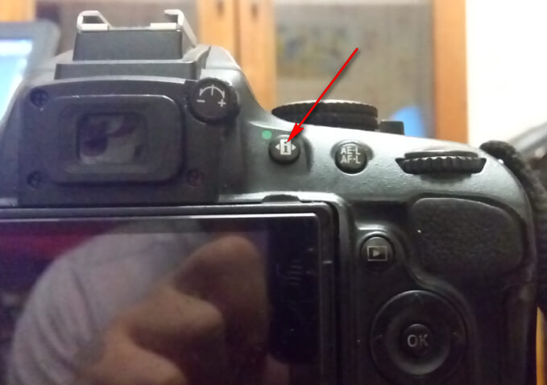
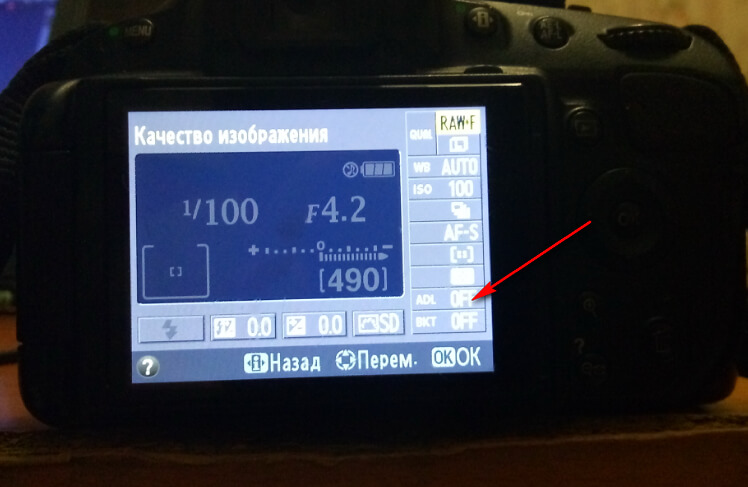
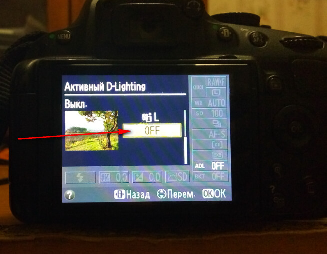

# В Lightroom фотографии становятся темнее. Nikon

Долго мучался с проблемой, что при добавлении фотографий в raw формате в Lightroom с фотоаппарата Nikon d5100, фотографии становятся темнее, чем соответствующие jpg варианты.

Итак, всё дело в том, что в настройках у меня был включен `D-Lighting`, позволяющий делать снимки, где темные и яркие участки более выровнены друг с другом в jpg варианте. `Lightroom` не умеет, как оказалось, работать с данной настройкой в raw варианте.

Если вы работаете с RAW, то вам эта настройка будет не нужна. Отключите.

Вот вам jpg с включенным D-Lighting:

Вот так эта фотка выглядит в Lightroom, если загрузить RAW версию снимка:

Как видим, jpg гораздо ярче (D-Light поработал).

А вот так выглядит jpg `с отключенным D-Light`:

А в Lightroom выглядит так:

Как видим, по экспозиции варианты не отличаются почти.

Ниже показано, как отключить этот режим на примере `Nikon d5100` в режиме `M`:

