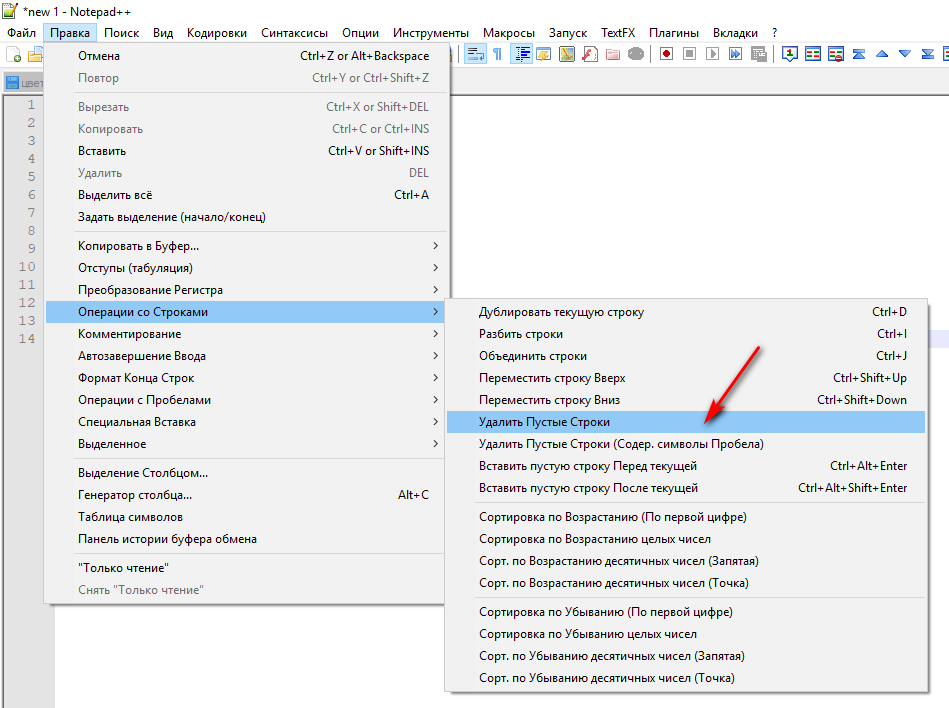
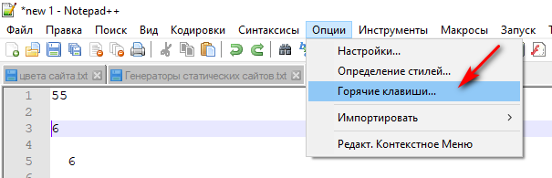
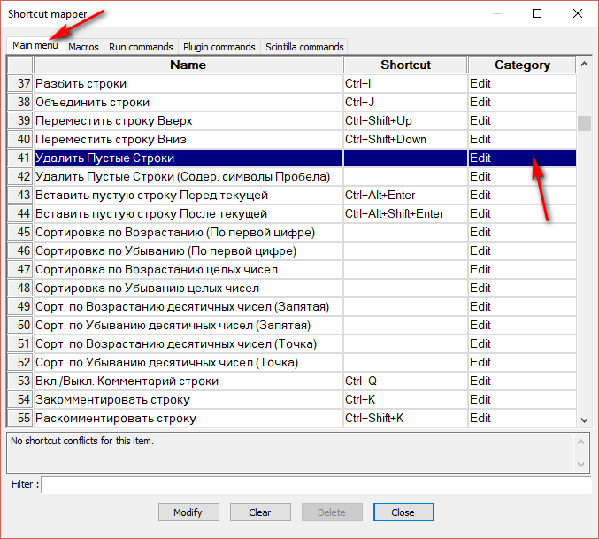
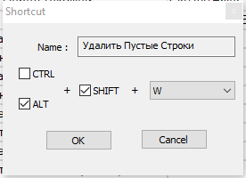
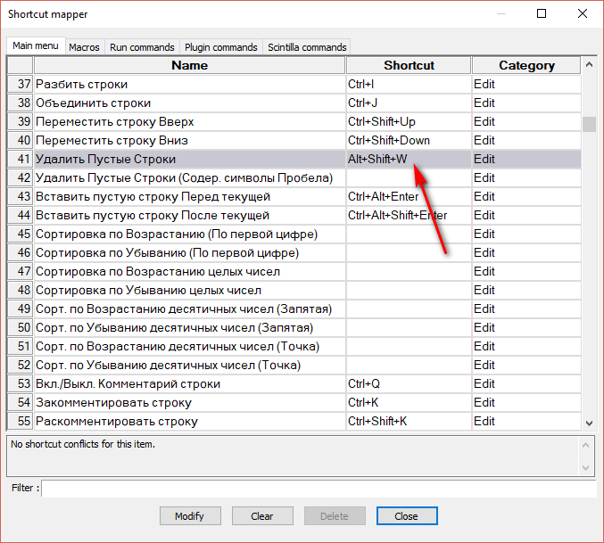
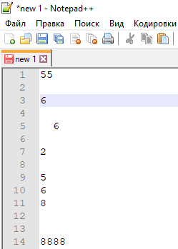
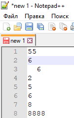

# Как удалить пустые строки в Notepad++ с помощью горячих клавиш

У одного товарища возник вопрос: «Как удалить пустые строки в Notepad++ с помощью горячих клавиш?» В статье решение.

В Notepad++ есть соответствующая команда для удаления пустых строк:

Назначим на неё горячую клавишу. Для этого идём в `Опции` → `Горячие клавиши…`:

Находим нашу команду в разделе `Main menu` и нажимаем на `Edit`:

Выбираем комбинацию горячих клавиш:

Видим, что у команды появилось описание горячих клавиш:

Применим. Есть у нас вот такой текст:

После нажатия на `Alt` + `Shift` + `W` пустые строки исчезнут:

